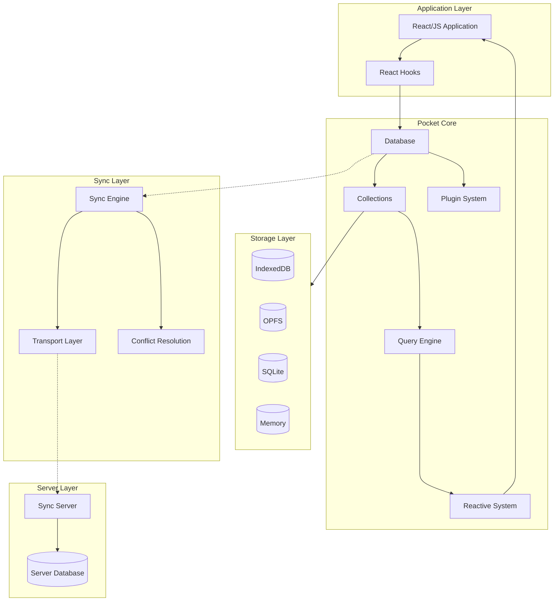
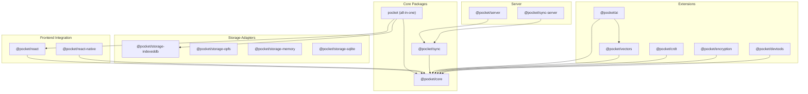
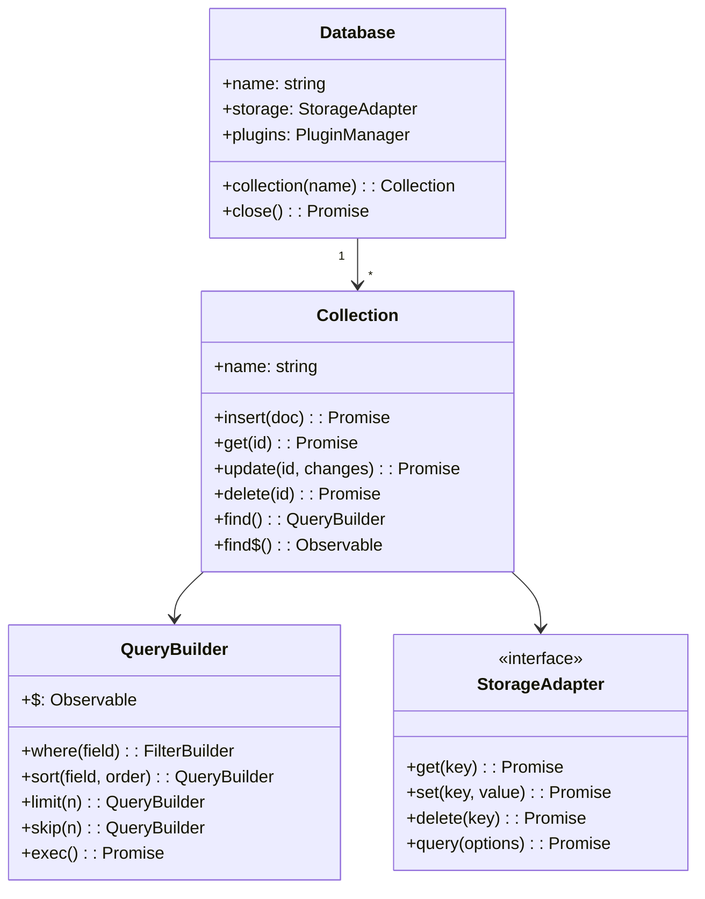
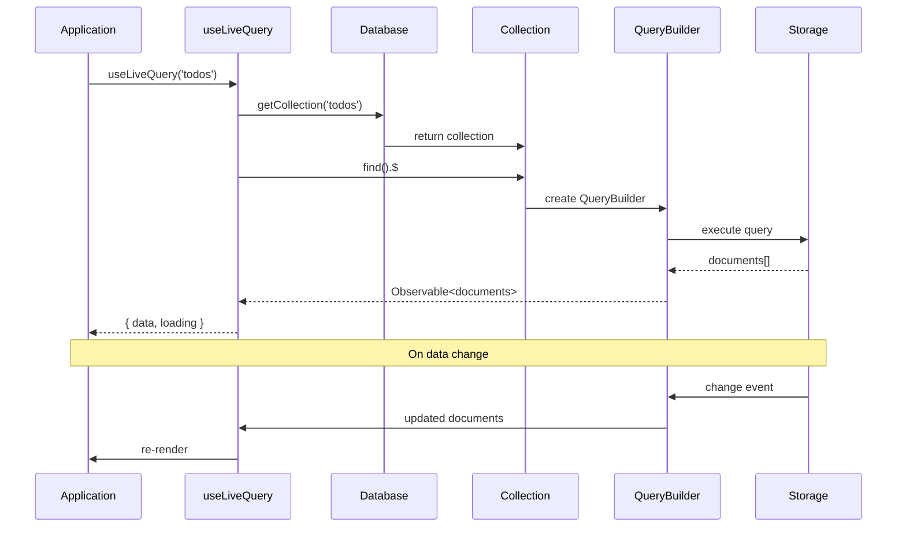
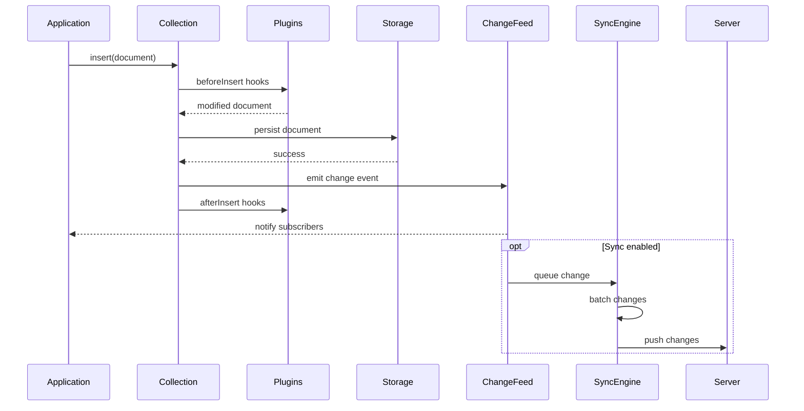
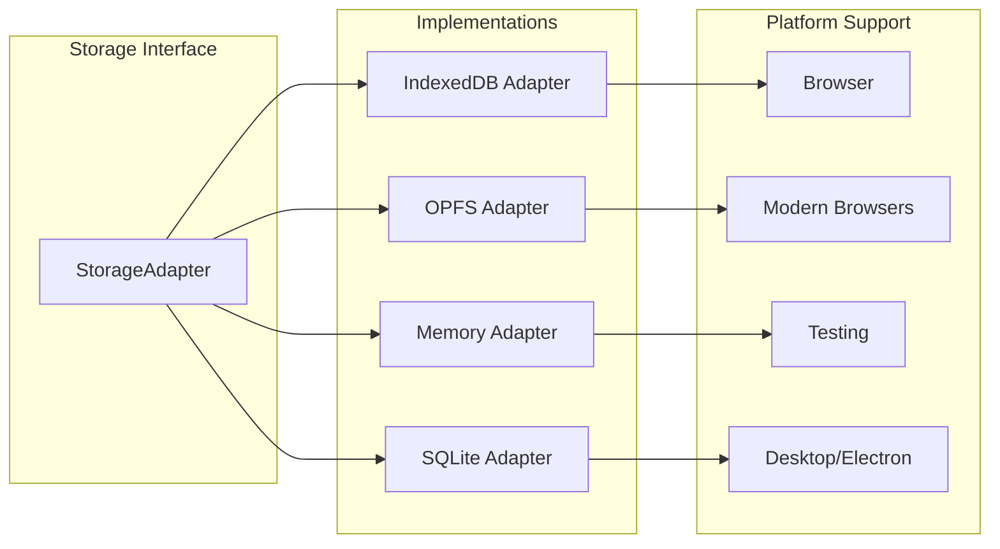
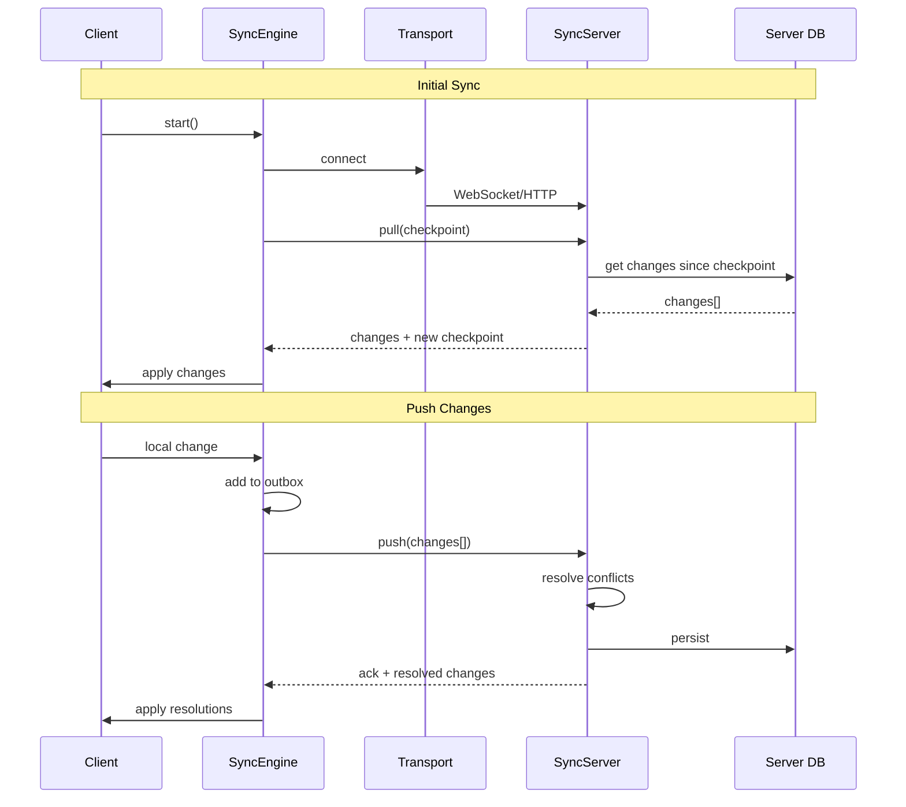
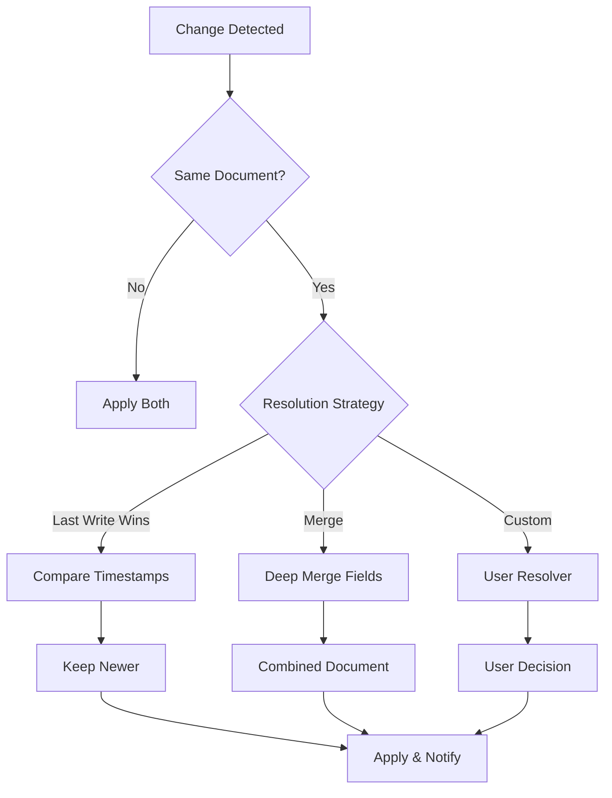
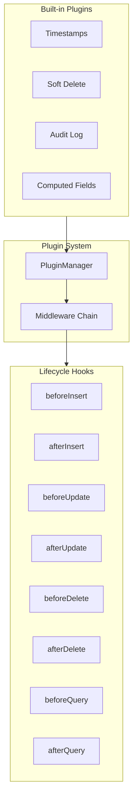

# Pocket Architecture

This document provides a comprehensive overview of Pocket's architecture, package structure, and design decisions.

## Table of Contents

- [Overview](#overview)
- [System Architecture](#system-architecture)
- [Package Structure](#package-structure)
- [Core Components](#core-components)
- [Data Flow](#data-flow)
- [Storage Layer](#storage-layer)
- [Sync Architecture](#sync-architecture)
- [Extension System](#extension-system)
- [Design Decisions](#design-decisions)

## Overview

Pocket is a **local-first database** for web applications. The core philosophy is:

1. **Data lives on the client** - All reads and writes happen locally first
2. **Works offline by default** - No network required for basic operations
3. **Sync is optional** - Add server synchronization when needed
4. **Type-safe by design** - Full TypeScript support with strict typing
5. **Modular architecture** - Use only what you need

## System Architecture



## Package Structure

Pocket is organized as a monorepo with 44 specialized packages:



### Package Categories

| Category | Packages | Description |
|----------|----------|-------------|
| **Core** | `@pocket/core`, `@pocket/sync`, `pocket` | Database engine, sync, and all-in-one bundle |
| **Frontend** | `@pocket/react`, `@pocket/react-native` | Framework integrations |
| **Storage** | `storage-indexeddb`, `storage-opfs`, `storage-memory`, `storage-sqlite` | Pluggable storage backends |
| **Server** | `@pocket/server`, `@pocket/sync-server` | Server-side sync infrastructure |
| **Data** | `@pocket/vectors`, `@pocket/crdt`, `@pocket/query` | Advanced data structures |
| **AI** | `@pocket/ai` | LLM integration with RAG pipeline |
| **Security** | `@pocket/encryption`, `@pocket/permissions` | Security and access control |
| **DX** | `@pocket/devtools`, `@pocket/time-travel` | Developer experience |
| **Features** | `@pocket/forms`, `@pocket/analytics`, `@pocket/presence`, `@pocket/cross-tab` | Application features |

## Core Components

### Database (`@pocket/core`)

The database is the central component that manages collections and coordinates operations.



### Core Module Structure

```
packages/core/src/
├── database/           # Database and Collection classes
│   ├── database.ts     # Main Database class
│   ├── collection.ts   # Collection with CRUD operations
│   └── document.ts     # Document utilities
├── query/              # Query engine
│   ├── query-builder.ts    # Fluent query API
│   ├── query-executor.ts   # Query execution
│   ├── query-planner.ts    # Query optimization
│   └── operators.ts        # Filter operators ($eq, $gt, etc.)
├── observable/         # Reactive system
│   ├── observable.ts   # Base observable utilities
│   ├── live-query.ts   # Live query subscriptions
│   └── event-reduce.ts # Event batching/debouncing
├── change-tracking/    # Change detection
│   ├── change-feed.ts  # Change event stream
│   └── vector-clock.ts # Causality tracking for sync
├── schema/             # Schema validation
│   └── schema.ts       # Zod-based validation
├── plugins/            # Plugin system
│   ├── plugin-manager.ts   # Plugin lifecycle
│   ├── middleware.ts       # Middleware chain
│   └── builtin/            # Built-in plugins
├── migrations/         # Schema migrations
│   ├── migration-manager.ts
│   └── migration-runner.ts
├── search/             # Full-text search
│   ├── search-index.ts # BM25 search index
│   └── tokenizer.ts    # Text tokenization
└── types/              # TypeScript types
    ├── document.ts
    ├── query.ts
    └── storage.ts
```

## Data Flow

### Read Path



### Write Path



## Storage Layer

Pocket uses a pluggable storage adapter pattern:



### Storage Adapter Interface

```typescript
interface StorageAdapter {
  // Document operations
  get<T>(collection: string, id: string): Promise<T | null>;
  set<T>(collection: string, id: string, doc: T): Promise<void>;
  delete(collection: string, id: string): Promise<void>;

  // Batch operations
  bulkGet<T>(collection: string, ids: string[]): Promise<T[]>;
  bulkSet<T>(collection: string, docs: T[]): Promise<void>;

  // Query operations
  query<T>(collection: string, options: QueryOptions): Promise<T[]>;
  count(collection: string, filter?: Filter): Promise<number>;

  // Index operations
  createIndex(collection: string, field: string): Promise<void>;

  // Lifecycle
  close(): Promise<void>;
  clear(): Promise<void>;
}
```

### Choosing a Storage Backend

| Backend | Use Case | Pros | Cons |
|---------|----------|------|------|
| **IndexedDB** | Default for web | Universal browser support | Slower for large datasets |
| **OPFS** | Large datasets | Fast, file-system based | Limited browser support |
| **Memory** | Testing | Instant, no persistence | Data lost on refresh |
| **SQLite** | Desktop apps | SQL queries, fast | Requires native bindings |

## Sync Architecture

### Sync Protocol



### Conflict Resolution



### Sync Module Structure

```
packages/sync/src/
├── sync-engine.ts      # Main sync coordinator
├── checkpoint.ts       # Checkpoint management
├── conflict.ts         # Conflict detection & resolution
├── optimistic.ts       # Optimistic updates
├── rollback.ts         # Rollback on sync failure
├── logger.ts           # Sync logging
├── transport/          # Transport layer
│   ├── types.ts        # Transport interface
│   ├── http.ts         # HTTP transport
│   └── websocket.ts    # WebSocket transport
└── selective/          # Selective sync
    ├── types.ts
    ├── filter-evaluator.ts
    └── selective-sync-manager.ts
```

## Extension System

### Plugin Architecture



### Creating a Plugin

```typescript
import { Plugin, PluginContext } from '@pocket/core';

const myPlugin: Plugin = {
  name: 'my-plugin',
  version: '1.0.0',

  install(context: PluginContext) {
    // Register hooks
    context.hooks.beforeInsert(async (doc, collection) => {
      return { ...doc, createdBy: getCurrentUser() };
    });

    context.hooks.afterUpdate(async (doc, collection) => {
      await logAuditEvent('update', doc);
    });
  },

  uninstall(context: PluginContext) {
    // Cleanup
  }
};
```

### Extension Packages

| Package | Purpose | Key Features |
|---------|---------|--------------|
| **@pocket/ai** | LLM Integration | RAG pipeline, embeddings, chat |
| **@pocket/vectors** | Vector Search | HNSW index, similarity search |
| **@pocket/crdt** | Collaboration | Conflict-free data types |
| **@pocket/encryption** | Security | E2E encryption, key management |
| **@pocket/permissions** | Access Control | Row-level security |
| **@pocket/devtools** | Debugging | Inspector, query profiler |
| **@pocket/time-travel** | History | Undo/redo, snapshots |
| **@pocket/presence** | Real-time | User presence, cursors |
| **@pocket/cross-tab** | Multi-tab | Cross-tab sync |
| **@pocket/forms** | UI Generation | Schema-driven forms |
| **@pocket/analytics** | Tracking | Offline analytics |

## Design Decisions

For detailed rationale behind major architectural decisions, see our [Architecture Decision Records (ADRs)](/docs/adr/):

1. **[ADR-001: Local-First Architecture](/docs/adr/001-local-first.md)** - Why data lives on the client first
2. **[ADR-002: RxJS for Reactivity](/docs/adr/002-rxjs-reactivity.md)** - Choosing RxJS for the reactive system
3. **[ADR-003: Pluggable Storage](/docs/adr/003-pluggable-storage.md)** - Storage adapter pattern
4. **[ADR-004: Vector Clocks for Sync](/docs/adr/004-vector-clocks.md)** - Causality tracking in sync
5. **[ADR-005: Monorepo Structure](/docs/adr/005-monorepo.md)** - Package organization

### Key Design Principles

1. **Separation of Concerns** - Each package has a single responsibility
2. **Dependency Inversion** - Core depends on interfaces, not implementations
3. **Progressive Enhancement** - Start simple, add features as needed
4. **Type Safety** - TypeScript throughout, generics for collections
5. **Tree Shaking** - Import only what you use
6. **Testability** - Memory storage for easy testing

## See Also

- [Getting Started](/docs/intro) - Quick start guide
- [API Reference](/docs/api/database) - Complete API documentation
- [Contributing](/CONTRIBUTING.md) - How to contribute
- [Development Guide](/DEVELOPMENT.md) - Development setup
