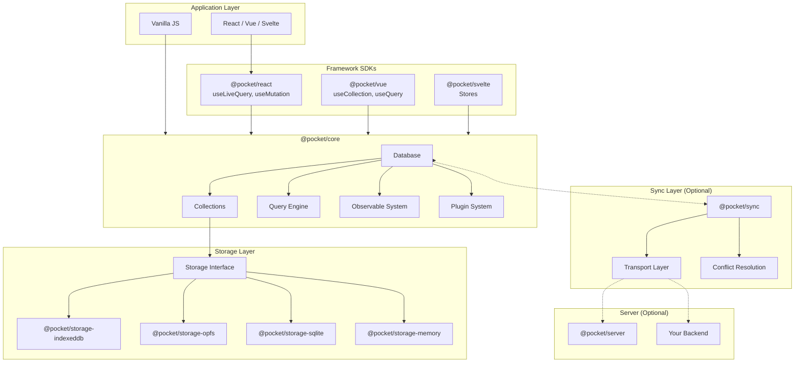
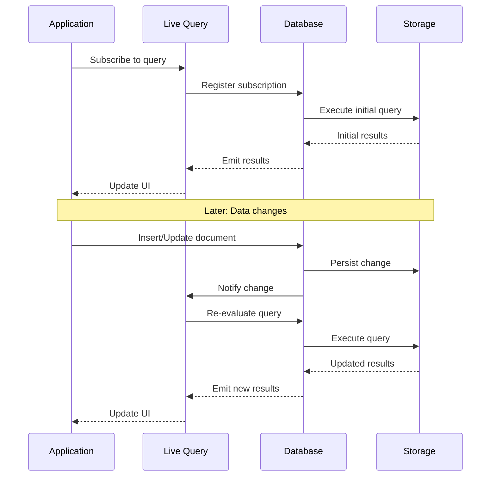
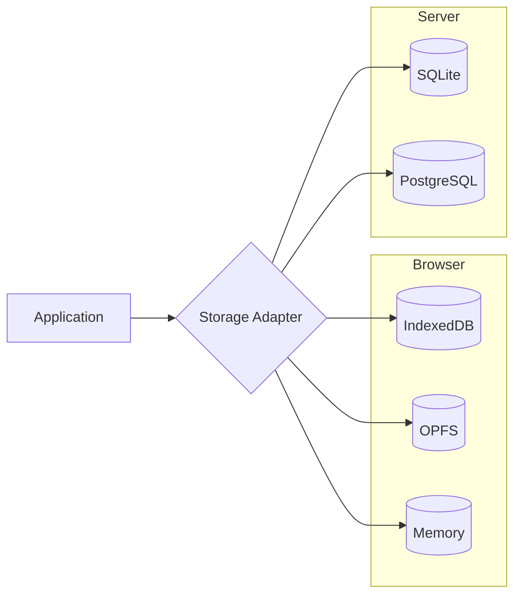
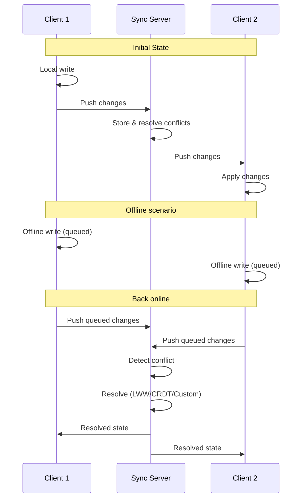
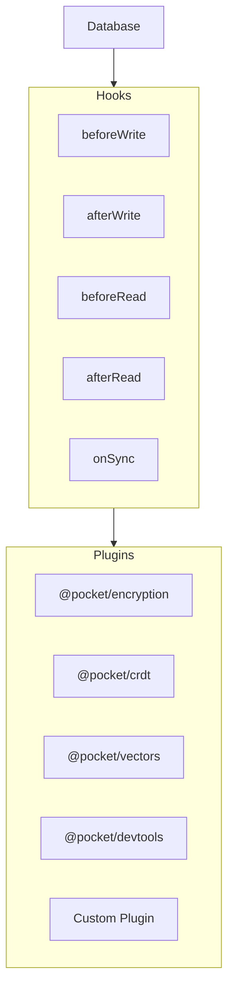
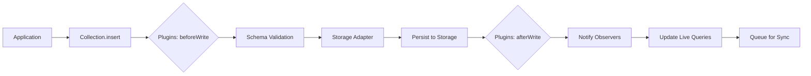
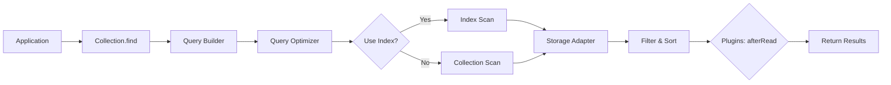
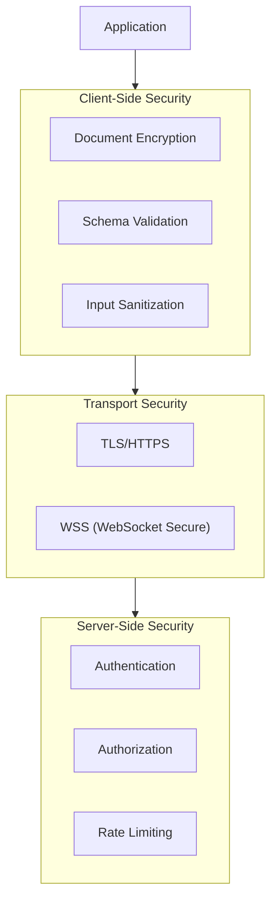

# Architecture Overview

This page provides a comprehensive view of Pocket's architecture, showing how all components work together to create a local-first database experience.

## System Architecture



## Core Components

### Database

The `Database` class is the entry point for all Pocket operations. It manages collections, coordinates storage, and handles the reactive system.

```typescript
import { Database, createIndexedDBStorage } from 'pocket';

const db = await Database.create({
  name: 'my-app',
  storage: createIndexedDBStorage(),
  plugins: [/* optional plugins */],
});
```

**Responsibilities:**
- Collection management and lifecycle
- Storage adapter coordination
- Plugin registration and execution
- Change propagation to reactive queries

### Collections

Collections store documents of a specific type. They provide CRUD operations and query capabilities.

```typescript
interface User {
  _id: string;
  name: string;
  email: string;
}

const users = db.collection<User>('users');
```

**Key Features:**
- Type-safe document operations
- Automatic ID generation
- Change tracking for reactivity
- Index management

### Query Engine

The query engine provides a fluent API for building and executing queries.

```typescript
const results = await users
  .find()
  .where('age').gte(18)
  .where('status').equals('active')
  .sort('name', 'asc')
  .limit(10)
  .exec();
```

**Capabilities:**
- Comparison operators (`eq`, `ne`, `gt`, `gte`, `lt`, `lte`)
- Logical operators (`and`, `or`, `not`)
- Array operators (`in`, `nin`, `contains`)
- String operators (`startsWith`, `endsWith`, `regex`)
- Sorting and pagination
- Index utilization

### Observable System

The observable system enables reactive queries that automatically update when data changes.



## Storage Architecture

Pocket uses a pluggable storage architecture that supports multiple backends.

### Storage Interface

All storage adapters implement a common interface:

```typescript
interface StorageAdapter {
  // Document operations
  get(collection: string, id: string): Promise<Document | null>;
  getMany(collection: string, ids: string[]): Promise<Document[]>;
  put(collection: string, doc: Document): Promise<void>;
  delete(collection: string, id: string): Promise<void>;

  // Query operations
  find(collection: string, query: Query): Promise<Document[]>;
  count(collection: string, query: Query): Promise<number>;

  // Index operations
  createIndex(collection: string, index: IndexDefinition): Promise<void>;
  dropIndex(collection: string, indexName: string): Promise<void>;

  // Lifecycle
  close(): Promise<void>;
  destroy(): Promise<void>;
}
```

### Storage Backends

| Backend | Best For | Browser Support | Performance |
|---------|----------|-----------------|-------------|
| **IndexedDB** | General use | All modern browsers | Good |
| **OPFS** | Large datasets | Chrome, Edge, Firefox | Excellent |
| **SQLite** | Node.js/Electron | N/A (server) | Excellent |
| **Memory** | Testing | All | Fastest (no persistence) |



## Sync Architecture

The sync layer enables multi-device synchronization while maintaining local-first principles.

### Sync Flow



### Conflict Resolution Strategies

| Strategy | Description | Use Case |
|----------|-------------|----------|
| **Last-Write-Wins** | Latest timestamp wins | Simple data, low conflict |
| **Field-Level Merge** | Merge non-conflicting fields | User profiles, settings |
| **CRDT** | Mathematically guaranteed merge | Collaborative editing |
| **Custom** | Application-specific logic | Complex business rules |

### Transport Layer

The sync engine supports multiple transports:

```typescript
import { createSyncEngine } from '@pocket/sync';
import { createWebSocketTransport, createHTTPTransport } from '@pocket/sync/transport';

// WebSocket for real-time sync
const wsSync = createSyncEngine(db, {
  transport: createWebSocketTransport({
    url: 'wss://api.example.com/sync',
  }),
});

// HTTP for polling-based sync
const httpSync = createSyncEngine(db, {
  transport: createHTTPTransport({
    url: 'https://api.example.com/sync',
    pollInterval: 30000,
  }),
});
```

## Plugin Architecture

Pocket's plugin system allows extending core functionality.



### Plugin Interface

```typescript
interface PocketPlugin {
  name: string;

  // Lifecycle hooks
  onInit?(db: Database): void | Promise<void>;
  onDestroy?(db: Database): void | Promise<void>;

  // Document hooks
  beforeWrite?(doc: Document, collection: string): Document | Promise<Document>;
  afterWrite?(doc: Document, collection: string): void | Promise<void>;
  beforeRead?(doc: Document, collection: string): Document | Promise<Document>;
  afterRead?(doc: Document, collection: string): void | Promise<void>;

  // Sync hooks
  beforeSync?(changes: Change[]): Change[] | Promise<Change[]>;
  afterSync?(changes: Change[]): void | Promise<void>;
}
```

### Built-in Plugins

| Plugin | Purpose |
|--------|---------|
| **@pocket/encryption** | End-to-end encryption for documents |
| **@pocket/crdt** | CRDT-based conflict resolution |
| **@pocket/vectors** | Vector embeddings for AI/ML |
| **@pocket/devtools** | Browser DevTools integration |
| **@pocket/opentelemetry** | Observability and tracing |

## Data Flow

### Write Path



### Read Path



## Performance Considerations

### Bundle Size

Pocket is designed to be tree-shakeable. Import only what you need:

```typescript
// Full bundle (~50KB)
import { Database, createIndexedDBStorage } from 'pocket';

// Minimal bundle (~25KB)
import { Database } from '@pocket/core';
import { createIndexedDBStorage } from '@pocket/storage-indexeddb';
```

### Memory Management

- **Query caching**: Frequently used queries are cached
- **Lazy loading**: Collections are loaded on first access
- **Subscription cleanup**: Automatic cleanup of unused subscriptions
- **Batch operations**: Group multiple writes for efficiency

### Indexing Strategy

Create indexes for frequently queried fields:

```typescript
// Create compound index
await users.createIndex({
  name: 'status_created',
  fields: ['status', 'createdAt'],
});

// Query uses the index automatically
const activeUsers = await users
  .find()
  .where('status').equals('active')
  .sort('createdAt', 'desc')
  .exec();
```

## Security Model



### Security Features

- **Client-side encryption**: Encrypt sensitive data before storage
- **Schema validation**: Prevent malformed data
- **Transport encryption**: TLS for all network communication
- **Server authorization**: Row-level security on sync server

## See Also

- [Local-First Architecture](/docs/concepts/local-first) - Why local-first matters
- [Database Model](/docs/concepts/database-model) - Document structure and collections
- [Reactive Queries](/docs/concepts/reactive-queries) - How live queries work
- [Storage Backends](/docs/concepts/storage-backends) - Storage options in detail
- [Sync Architecture](/docs/concepts/sync-architecture) - Sync protocol details
