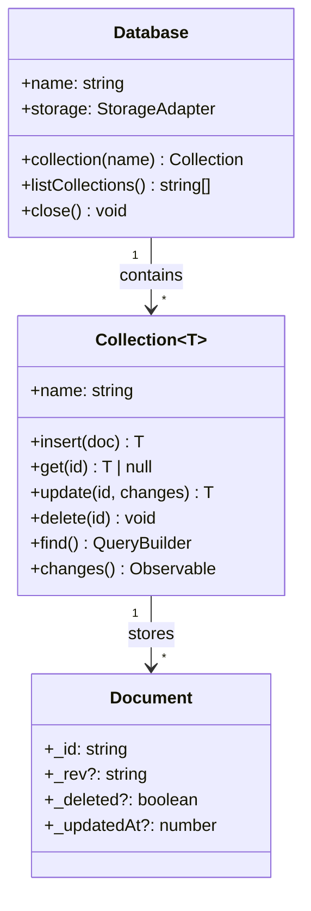
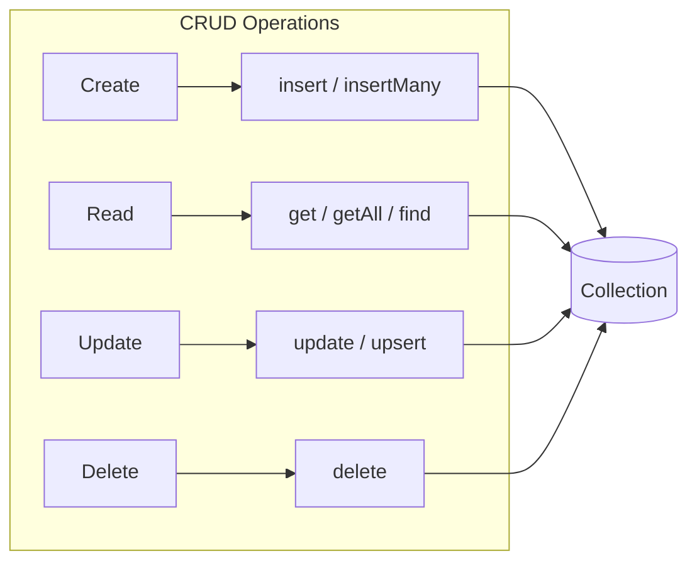

# Database Model

Pocket uses a document database model similar to MongoDB or Firebase. This page explains the core concepts.

## Overview



**Hierarchy Example:**

```
Database
  └── Collection ("todos")
        ├── Document { _id: "1", title: "Learn Pocket", ... }
        ├── Document { _id: "2", title: "Build app", ... }
        └── Document { _id: "3", title: "Ship it", ... }
  └── Collection ("users")
        ├── Document { _id: "u1", name: "Alice", ... }
        └── Document { _id: "u2", name: "Bob", ... }
```

## Database

The database is the top-level container. It manages collections and storage.

```typescript
import { Database, createIndexedDBStorage } from 'pocket';

const db = await Database.create({
  name: 'my-app',           // Unique name for this database
  storage: createIndexedDBStorage(),
  version: 1,               // Schema version (optional)
  nodeId: 'client-123',     // Unique ID for this client (optional, auto-generated)
});
```

### Database Options

| Option | Type | Description |
|--------|------|-------------|
| `name` | `string` | Required. Unique database identifier |
| `storage` | `StorageAdapter` | Required. Where to store data |
| `version` | `number` | Schema version for migrations |
| `nodeId` | `string` | Client identifier for sync |
| `collections` | `CollectionConfig[]` | Pre-configure collections |

### Database Methods

```typescript
// Get a collection (creates if doesn't exist)
const todos = db.collection('todos');

// Check if collection exists
const exists = db.hasCollection('todos');

// List all collections
const names = await db.listCollections();

// Delete a collection
await db.deleteCollection('todos');

// Get storage statistics
const stats = await db.getStats();

// Close the database
await db.close();
```

## Collections

A collection holds related documents. Think of it like a table in SQL databases.

```typescript
interface Todo {
  _id: string;
  title: string;
  completed: boolean;
  tags: string[];
  createdAt: Date;
}

const todos = db.collection<Todo>('todos');
```

### TypeScript Support

Collections are fully typed:

```typescript
// TypeScript knows the shape of your data
const todo = await todos.get('123');
//    ^? Todo | null

const results = await todos.find().exec();
//    ^? Todo[]

// Type errors caught at compile time
await todos.insert({
  _id: '1',
  title: 'Test',
  completed: 'yes', // Error: Type 'string' not assignable to 'boolean'
});
```

### Collection Methods



```typescript
// CRUD operations
await todos.insert(doc);           // Create
await todos.insertMany([doc1, doc2]);
const todo = await todos.get(id);  // Read one
const all = await todos.getAll();  // Read all
await todos.update(id, changes);   // Update
await todos.upsert(id, doc);       // Insert or update
await todos.delete(id);            // Delete (soft delete if sync enabled)

// Querying
const query = todos.find();                    // Query builder
const results = await todos.find().exec();     // Execute query
const one = await todos.findOne({ status: 'active' });

// Counting
const count = await todos.count();
const filtered = await todos.count({ completed: false });

// Indexes
await todos.createIndex({ fields: ['completed'] });
await todos.dropIndex('completed');
const indexes = await todos.getIndexes();

// Observables
todos.changes().subscribe(event => console.log(event));
todos.observeById(id).subscribe(doc => console.log(doc));
```

## Documents

Documents are JSON objects with a required `_id` field.

```typescript
interface Document {
  _id: string;      // Required, unique identifier
  _rev?: string;    // Revision (managed by Pocket)
  _deleted?: boolean; // Soft delete flag
  _updatedAt?: number; // Last update timestamp
  // ... your fields
}
```

### Document Rules

1. **`_id` is required** - Every document must have a unique identifier
2. **Fields prefixed with `_` are reserved** - Don't use them for your data
3. **Documents are JSON-serializable** - Stick to primitives, objects, and arrays

### Generating IDs

```typescript
// Use crypto.randomUUID() for unique IDs
await todos.insert({
  _id: crypto.randomUUID(),
  title: 'New todo',
});

// Or use meaningful IDs
await todos.insert({
  _id: `user:${userId}:todo:${Date.now()}`,
  title: 'New todo',
});
```

### Timestamps and Metadata

Pocket automatically tracks metadata for sync:

```typescript
const todo = await todos.get('123');

console.log(todo._updatedAt);  // Last modification timestamp
console.log(todo._rev);        // Revision for conflict detection
console.log(todo._deleted);    // true if soft-deleted
```

## Pre-configured Collections

Define collections upfront with schemas and indexes:

```typescript
const db = await Database.create({
  name: 'my-app',
  storage: createIndexedDBStorage(),
  collections: [
    {
      name: 'todos',
      sync: true,  // Enable sync for this collection
      indexes: [
        { fields: ['completed'] },
        { fields: ['createdAt'] },
      ],
      schema: {
        type: 'object',
        required: ['title'],
        properties: {
          title: { type: 'string', minLength: 1 },
          completed: { type: 'boolean', default: false },
        },
      },
    },
  ],
});
```

## Data Relationships

Pocket doesn't enforce relationships, but you can model them:

### Embedded Documents

```typescript
interface Post {
  _id: string;
  title: string;
  comments: Comment[]; // Embedded
}

// Good for: data that's always accessed together
```

### References

```typescript
interface Post {
  _id: string;
  title: string;
  authorId: string; // Reference to users collection
}

// Fetch related data manually
const post = await posts.get('post-1');
const author = await users.get(post.authorId);
```

### Denormalization

```typescript
interface Post {
  _id: string;
  title: string;
  authorId: string;
  authorName: string; // Duplicated for fast reads
}

// Update when author changes
users.changes().subscribe(async (event) => {
  if (event.operation === 'update') {
    const userPosts = await posts.find({ authorId: event.documentId }).exec();
    for (const post of userPosts) {
      await posts.update(post._id, { authorName: event.document.name });
    }
  }
});
```

## Next Steps

- [Reactive Queries](/docs/concepts/reactive-queries) - Live updating query results
- [Schema Validation](/docs/guides/schema-validation) - Validate documents on write
- [API Reference: Collection](/docs/api/collection) - Complete collection API
