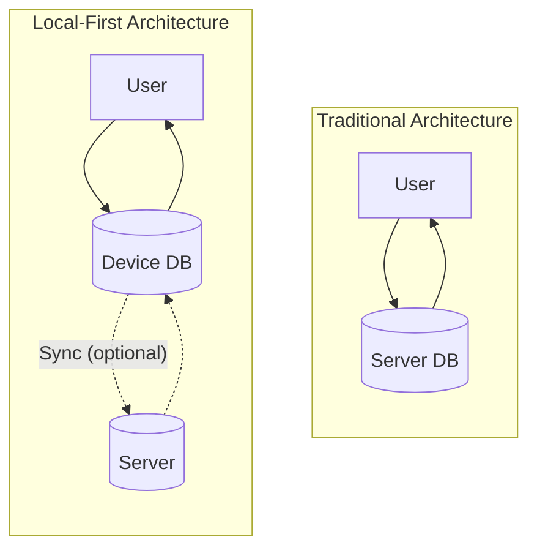
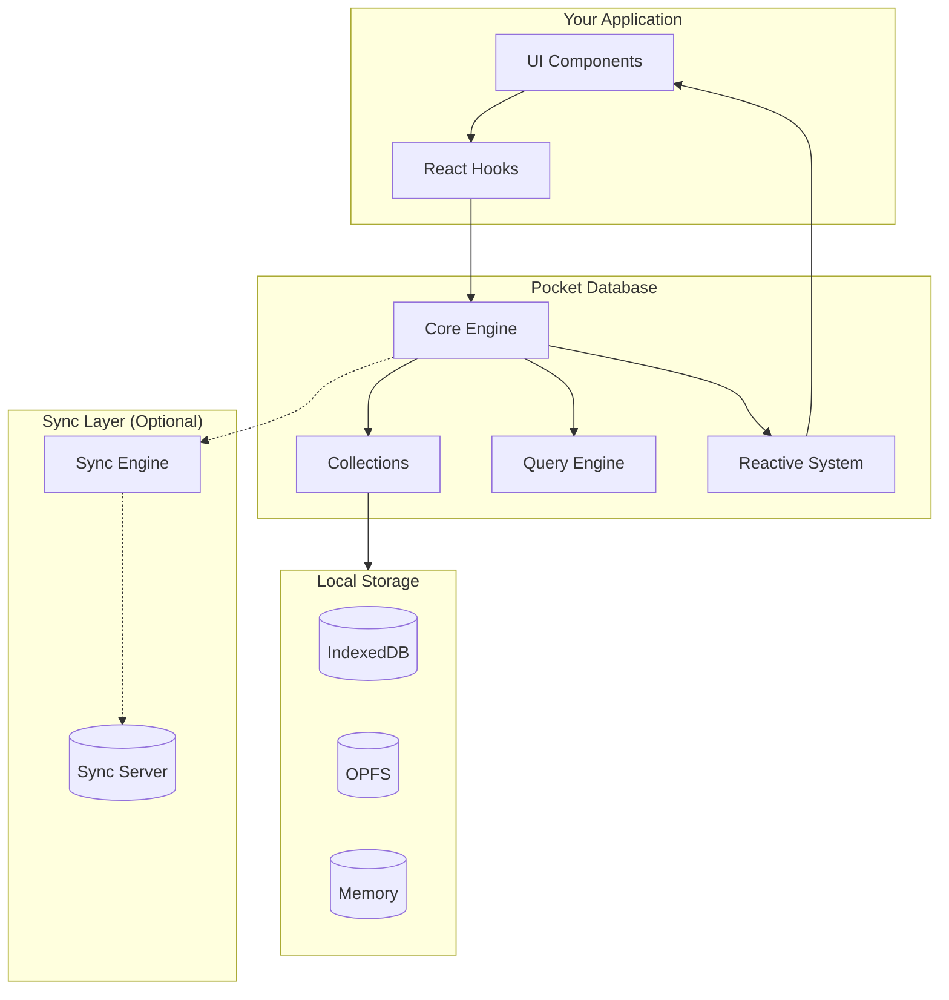

# Local-First Architecture

Pocket is built on local-first principles. This page explains what that means and why it benefits your applications.

## What is Local-First?

Local-first software stores data primarily on the user's device, not on a server. The server becomes optional rather than required.



**Traditional vs Local-First:**

| Traditional | Local-First |
|-------------|-------------|
| Data lives on server | Data lives on device |
| Server required | Server optional |
| Network-dependent | Works offline |

## Key Benefits

### 1. Instant Performance

Reads and writes happen locally. No network round-trip means operations complete in milliseconds.

```typescript
// This is instant - no server request
const todos = await db.collection('todos').find().exec();
```

### 2. Works Offline

Your app works without an internet connection. Users can view, create, and edit data anytime.

```typescript
// Works whether online or offline
await todos.insert({
  _id: crypto.randomUUID(),
  title: 'Created while offline',
  completed: false,
});
```

### 3. Real-Time Feel

Local changes appear immediately. No loading spinners for local operations.

```typescript
// UI updates instantly
todos.find().live().subscribe((results) => {
  renderTodoList(results); // Immediate update
});

await todos.update(id, { completed: true }); // Triggers instant re-render
```

### 4. User Owns Their Data

Data is stored on the user's device. They have full control and can access it even if your service shuts down.

### 5. Reduced Server Costs

Most operations happen client-side. Your server only handles sync, which can be batched and optimized.

## How Pocket Implements Local-First



### Client-Side Storage

Pocket uses browser storage APIs to persist data:

```typescript
import { createIndexedDBStorage, createOPFSStorage } from 'pocket';

// IndexedDB - works in all browsers
const storage = createIndexedDBStorage();

// OPFS - faster, for modern browsers
const storage = createOPFSStorage();
```

### Reactive Queries

Data changes propagate automatically through your app:

```typescript
// Subscribe once, get updates forever
const subscription = db
  .collection('todos')
  .find()
  .where('completed').equals(false)
  .live()
  .subscribe((todos) => {
    // Called whenever matching todos change
    updateUI(todos);
  });
```

### Optional Sync

Add sync when you need it, but your app works without it:

```typescript
import { createSyncEngine } from 'pocket/sync';

// Sync is additive - everything still works without it
const sync = createSyncEngine(db, {
  serverUrl: 'https://api.example.com/sync',
  collections: ['todos'],
});

await sync.start();
```

## When to Use Local-First

Local-first works well for:

- **Productivity apps** - Notes, todos, documents
- **Creative tools** - Drawing, music, design apps
- **Field work** - Apps used in areas with poor connectivity
- **Privacy-focused apps** - Data stays on device
- **Real-time collaboration** - Combined with sync/CRDTs

Consider alternatives when:

- Data must be authoritative (banking, legal records)
- You need server-side validation before writes
- Storage limits are a concern (browsers cap at ~1GB)

## Comparison with Traditional Architectures

| Aspect | Traditional | Local-First (Pocket) |
|--------|-------------|---------------------|
| Read latency | 100-500ms | &lt;10ms |
| Write latency | 100-500ms | &lt;10ms |
| Offline support | None/limited | Full |
| Initial load | Slow (fetch data) | Instant (local data) |
| Server dependency | Required | Optional |
| Data ownership | Server | User |

## Learn More

- [Ink & Switch: Local-First Software](https://www.inkandswitch.com/local-first/) - The foundational paper on local-first principles
- [Storage Backends](/docs/concepts/storage-backends) - How Pocket stores data locally
- [Sync Architecture](/docs/concepts/sync-architecture) - How sync works when needed
