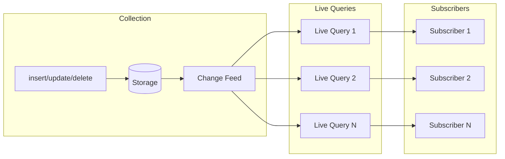
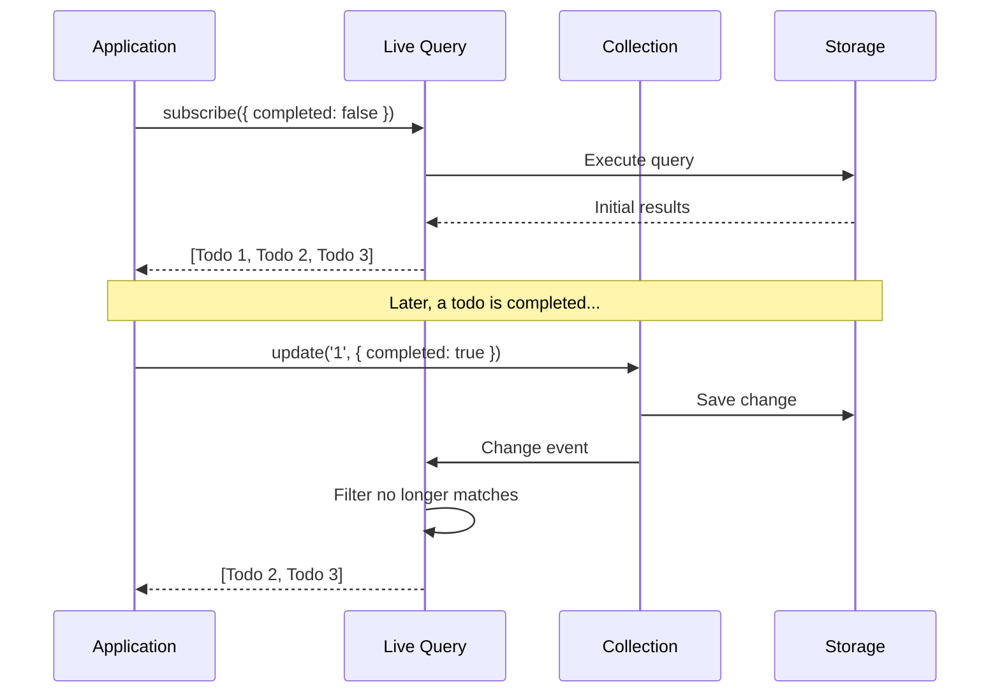

# Reactive Queries

Pocket's reactive queries automatically update when underlying data changes. This page explains how they work and best practices for using them.

## The Problem with Traditional Queries

In traditional database access, you query once and get a snapshot:

```typescript
// Traditional approach
const todos = await fetchTodos(); // Snapshot at this moment
// If another tab adds a todo, this list is now stale
```

You're responsible for re-fetching when data changes. This leads to:
- Stale data shown to users
- Complex cache invalidation logic
- Manual refresh buttons everywhere

## Live Queries

Pocket's live queries subscribe to changes and re-emit results automatically:

```typescript
// Pocket approach
db.collection('todos')
  .find()
  .live()
  .subscribe((todos) => {
    // Called immediately with current data
    // Called again whenever todos change
    renderTodos(todos);
  });
```

The subscription stays active and pushes updates to you.

## How It Works



**The reactive flow:**

1. Every write operation emits a change event
2. Live queries listen to the change feed
3. When a change might affect results, the query re-executes
4. New results are pushed to subscribers

## Basic Usage

### Simple Live Query

```typescript
const todos = db.collection<Todo>('todos');

// Subscribe to all todos
const subscription = todos
  .find()
  .live()
  .subscribe((results) => {
    console.log('Todos:', results);
  });

// Changes trigger updates
await todos.insert({ _id: '1', title: 'New todo', completed: false });
// Console: Todos: [{ _id: '1', title: 'New todo', ... }]

await todos.update('1', { completed: true });
// Console: Todos: [{ _id: '1', title: 'New todo', completed: true, ... }]

// Clean up when done
subscription.unsubscribe();
```

### Filtered Live Query



```typescript
// Only incomplete todos
todos
  .find()
  .where('completed').equals(false)
  .live()
  .subscribe((incomplete) => {
    console.log('Incomplete:', incomplete.length);
  });

// When a todo is completed, it's removed from results
await todos.update('1', { completed: true });
// Results automatically exclude the completed todo
```

### Sorted and Limited

```typescript
// Latest 10 todos
todos
  .find()
  .sort('createdAt', 'desc')
  .limit(10)
  .live()
  .subscribe((latest) => {
    renderRecentTodos(latest);
  });
```

## Live Query Options

```typescript
todos
  .find()
  .live({
    debounceMs: 100,      // Batch rapid updates
    useEventReduce: true, // Optimize for performance (default: true)
  })
  .subscribe(callback);
```

### Debouncing

When many changes happen quickly, debouncing prevents excessive re-renders:

```typescript
// Without debouncing: callback fires 100 times
// With debounceMs: 100, callback fires once after changes settle
todos
  .find()
  .live({ debounceMs: 100 })
  .subscribe((results) => {
    // Called at most every 100ms
    renderTodos(results);
  });

// Batch insert triggers single update
for (let i = 0; i < 100; i++) {
  await todos.insert({ _id: `${i}`, title: `Todo ${i}`, completed: false });
}
```

### EventReduce Optimization

EventReduce analyzes change events to avoid full re-queries when possible:

```typescript
// With EventReduce (default)
// - Insert: Add doc to result set if it matches filter
// - Update: Update doc in result set, re-sort if needed
// - Delete: Remove doc from result set

// Without EventReduce
// - Every change triggers full query re-execution
```

Keep `useEventReduce: true` (the default) for better performance.

## Observing Single Documents

To watch a specific document by ID:

```typescript
// Observe one document
todos.observeById('todo-123').subscribe((todo) => {
  if (todo) {
    console.log('Todo updated:', todo);
  } else {
    console.log('Todo deleted or not found');
  }
});
```

## Change Events

For fine-grained control, subscribe to raw change events:

```typescript
todos.changes().subscribe((event) => {
  console.log('Operation:', event.operation); // 'insert' | 'update' | 'delete'
  console.log('Document ID:', event.documentId);
  console.log('New document:', event.document);
  console.log('Previous document:', event.previousDocument);
  console.log('From sync:', event.isFromSync);
  console.log('Timestamp:', event.timestamp);
});
```

This is useful for:
- Audit logging
- Syncing to external systems
- Custom cache invalidation
- Analytics

## RxJS Integration

Live queries return RxJS Observables. You can use any RxJS operators:

```typescript
import { map, filter, distinctUntilChanged } from 'rxjs/operators';

todos
  .find()
  .live()
  .pipe(
    map((todos) => todos.length),
    distinctUntilChanged(),
  )
  .subscribe((count) => {
    console.log('Todo count changed:', count);
  });
```

## Common Patterns

### Combining Multiple Queries

```typescript
import { combineLatest } from 'rxjs';

const incomplete$ = todos.find().where('completed').equals(false).live();
const complete$ = todos.find().where('completed').equals(true).live();

combineLatest([incomplete$, complete$]).subscribe(([incomplete, complete]) => {
  console.log(`${incomplete.length} incomplete, ${complete.length} complete`);
});
```

### Derived State

```typescript
todos
  .find()
  .live()
  .pipe(
    map((todos) => ({
      all: todos,
      incomplete: todos.filter((t) => !t.completed),
      complete: todos.filter((t) => t.completed),
      stats: {
        total: todos.length,
        percentComplete: todos.filter((t) => t.completed).length / todos.length,
      },
    })),
  )
  .subscribe((state) => {
    renderDashboard(state);
  });
```

### Error Handling

```typescript
todos
  .find()
  .live()
  .subscribe({
    next: (results) => renderTodos(results),
    error: (err) => showError(err),
  });
```

## Performance Considerations

### Do

- **Unsubscribe when done** - Prevents memory leaks
- **Use debouncing for UI updates** - Prevents excessive re-renders
- **Keep EventReduce enabled** - Default optimization
- **Use specific filters** - Narrower queries are faster

### Don't

- **Don't subscribe in loops** - One subscription per component
- **Don't ignore cleanup** - Always unsubscribe
- **Don't over-query** - Subscribe to what you need

```typescript
// Bad: Multiple subscriptions
function TodoItem({ id }) {
  const [todo, setTodo] = useState(null);

  useEffect(() => {
    // Creates a new subscription for every item!
    const sub = todos.observeById(id).subscribe(setTodo);
    return () => sub.unsubscribe();
  }, [id]);
}

// Good: Single subscription, filter in UI
function TodoList({ ids }) {
  const [allTodos, setAllTodos] = useState([]);

  useEffect(() => {
    const sub = todos.find().live().subscribe(setAllTodos);
    return () => sub.unsubscribe();
  }, []);

  const visibleTodos = allTodos.filter((t) => ids.includes(t._id));
}
```

## Next Steps

- [React Integration](/docs/guides/react-integration) - Using live queries with React hooks
- [Query Builder API](/docs/api/query-builder) - Complete query API reference
- [Indexing](/docs/guides/indexing) - Optimize query performance
