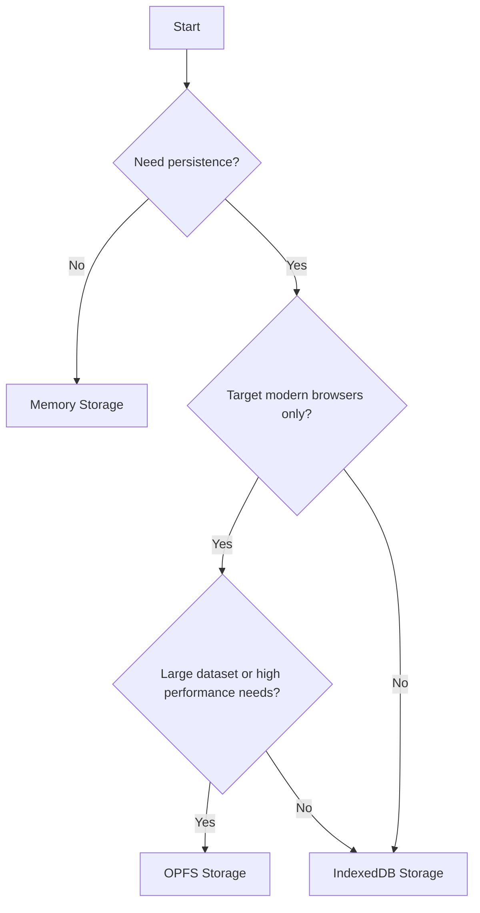

# Storage Backends

Pocket supports multiple storage backends. Each has different trade-offs for performance, browser support, and use cases.

## Overview

| Storage | Best For | Browser Support | Persistence | Speed |
|---------|----------|-----------------|-------------|-------|
| IndexedDB | Most apps | All browsers | Yes | Good |
| OPFS | Performance-critical | Modern browsers | Yes | Excellent |
| Memory | Testing | All browsers | No | Fastest |

## IndexedDB Storage

IndexedDB is the default choice for most applications. It's supported everywhere and provides reliable persistence.

```typescript
import { Database, createIndexedDBStorage } from 'pocket';

const db = await Database.create({
  name: 'my-app',
  storage: createIndexedDBStorage(),
});
```

### Characteristics

- **Universal support** - Works in all modern browsers
- **Good performance** - Handles most workloads well
- **Large storage quota** - Typically 50-80% of available disk space
- **Async API** - Non-blocking operations
- **Transactional** - ACID-compliant writes

### When to Use

- Default choice for web applications
- When you need maximum browser compatibility
- For applications with typical read/write patterns

### Storage Limits

IndexedDB quotas vary by browser:

| Browser | Default Quota |
|---------|---------------|
| Chrome | 80% of disk space (up to ~2GB per origin) |
| Firefox | 50% of disk space |
| Safari | 1GB per origin |

### Example

```typescript
import { createIndexedDBStorage } from 'pocket';

const storage = createIndexedDBStorage();

const db = await Database.create({
  name: 'my-app',
  storage,
});

// Check storage stats
const stats = await db.getStats();
console.log('Storage used:', stats.storageSize);
```

## OPFS Storage

OPFS (Origin Private File System) provides faster file-based storage for modern browsers.

```typescript
import { Database, createOPFSStorage } from 'pocket';

const db = await Database.create({
  name: 'my-app',
  storage: createOPFSStorage(),
});
```

### Characteristics

- **High performance** - Faster than IndexedDB for large datasets
- **File-based** - Data stored as files
- **Web Worker support** - Can run off the main thread
- **Modern browsers only** - Chrome 86+, Firefox 111+, Safari 15.2+

### When to Use

- Large datasets (10k+ documents)
- Performance-critical applications
- When targeting modern browsers
- Heavy read/write workloads

### Architecture

OPFS uses a write-ahead log (WAL) for durability:

```
┌─────────────────────────────────────┐
│            OPFS Storage             │
│                                     │
│  ┌─────────────┐  ┌──────────────┐ │
│  │ Data Files  │  │  WAL Files   │ │
│  │             │  │              │ │
│  │ todos.json  │  │ todos.wal    │ │
│  │ users.json  │  │ users.wal    │ │
│  └─────────────┘  └──────────────┘ │
└─────────────────────────────────────┘
```

### Example

```typescript
import { createOPFSStorage } from 'pocket';

const storage = createOPFSStorage({
  // Options
  directory: 'pocket-data', // Root directory name
});

const db = await Database.create({
  name: 'my-app',
  storage,
});
```

### Checking Availability

```typescript
import { createOPFSStorage } from 'pocket';

const storage = createOPFSStorage();

if (storage.isAvailable()) {
  console.log('OPFS is available');
} else {
  console.log('Falling back to IndexedDB');
}
```

## Memory Storage

In-memory storage is perfect for testing and temporary data.

```typescript
import { Database, createMemoryStorage } from 'pocket';

const db = await Database.create({
  name: 'test-db',
  storage: createMemoryStorage(),
});
```

### Characteristics

- **Fastest** - No I/O overhead
- **No persistence** - Data lost on page refresh
- **Unlimited** - Only constrained by available RAM
- **Perfect for testing** - Fast, isolated test runs

### When to Use

- Unit tests
- Integration tests
- Temporary/session data
- Development and prototyping

### Example: Testing

```typescript
import { describe, it, beforeEach } from 'vitest';
import { Database, createMemoryStorage } from 'pocket';

describe('Todo tests', () => {
  let db: Database;

  beforeEach(async () => {
    // Fresh database for each test
    db = await Database.create({
      name: 'test',
      storage: createMemoryStorage(),
    });
  });

  it('should insert a todo', async () => {
    const todos = db.collection('todos');
    await todos.insert({ _id: '1', title: 'Test', completed: false });

    const result = await todos.get('1');
    expect(result?.title).toBe('Test');
  });
});
```

## Choosing a Storage Backend



### Decision Matrix

| Requirement | Recommended Storage |
|-------------|---------------------|
| Maximum browser compatibility | IndexedDB |
| Best performance | OPFS |
| Testing | Memory |
| Safari support | IndexedDB |
| Large datasets (100k+ docs) | OPFS |
| PWA/Offline app | IndexedDB or OPFS |

## Fallback Pattern

Use OPFS when available, fall back to IndexedDB:

```typescript
import {
  Database,
  createOPFSStorage,
  createIndexedDBStorage,
} from 'pocket';

function createStorage() {
  const opfs = createOPFSStorage();

  if (opfs.isAvailable()) {
    console.log('Using OPFS storage');
    return opfs;
  }

  console.log('Falling back to IndexedDB');
  return createIndexedDBStorage();
}

const db = await Database.create({
  name: 'my-app',
  storage: createStorage(),
});
```

## Storage Adapter Interface

All storage adapters implement the same interface:

```typescript
interface StorageAdapter {
  name: string;

  // Lifecycle
  initialize(config: StorageConfig): Promise<void>;
  close(): Promise<void>;
  isAvailable(): boolean;

  // Store operations
  getStore<T>(name: string): DocumentStore<T>;
  hasStore(name: string): boolean;
  listStores(): Promise<string[]>;
  deleteStore(name: string): Promise<void>;

  // Transactions
  transaction<R>(
    storeNames: string[],
    mode: 'readonly' | 'readwrite',
    fn: () => Promise<R>
  ): Promise<R>;

  // Stats
  getStats(): Promise<StorageStats>;
}
```

## Custom Storage Adapters

You can create custom storage adapters for specific needs:

```typescript
class CustomStorage implements StorageAdapter {
  name = 'custom';

  async initialize(config: StorageConfig): Promise<void> {
    // Initialize your storage
  }

  // ... implement other methods
}

const db = await Database.create({
  name: 'my-app',
  storage: new CustomStorage(),
});
```

## Next Steps

- [Sync Architecture](/docs/concepts/sync-architecture) - How data syncs across devices
- [Indexing](/docs/guides/indexing) - Optimize query performance
- [Database API](/docs/api/database) - Complete database API reference
