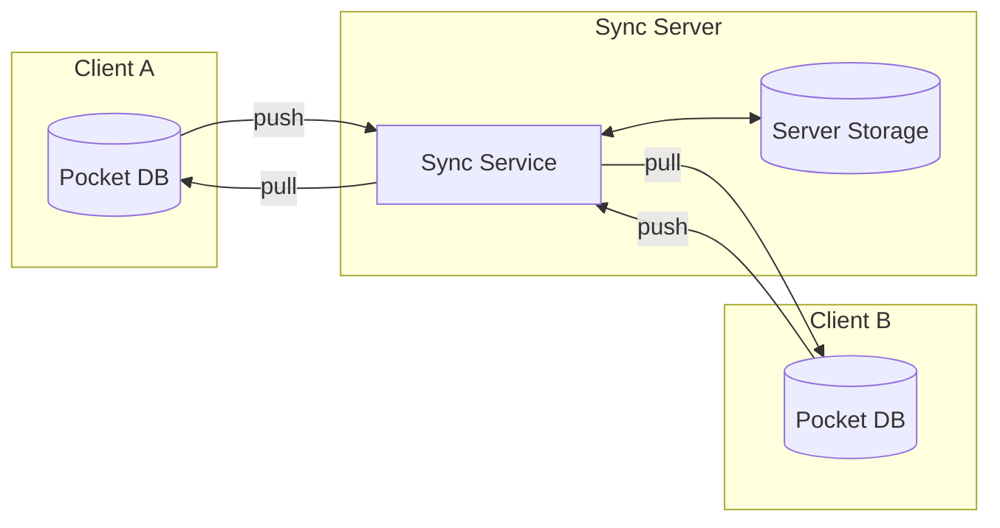
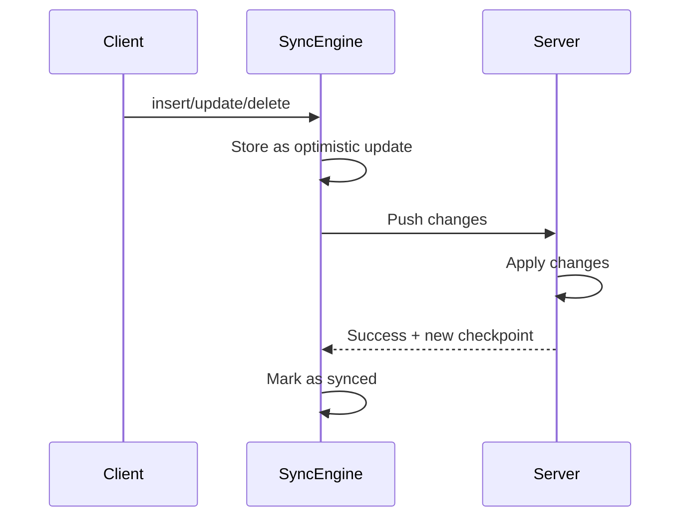
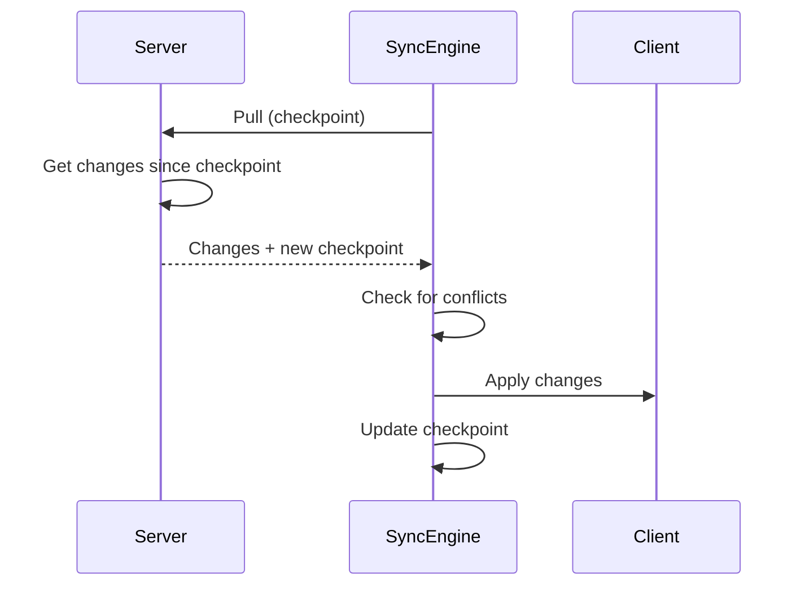
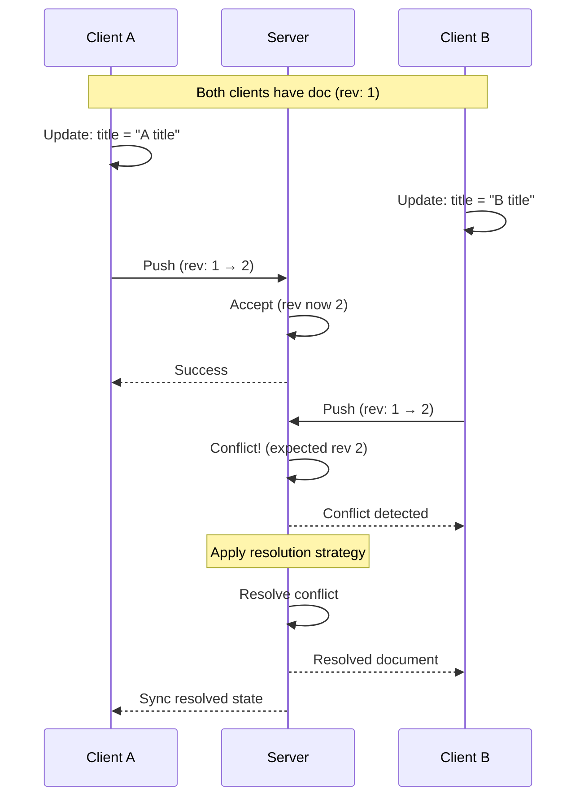
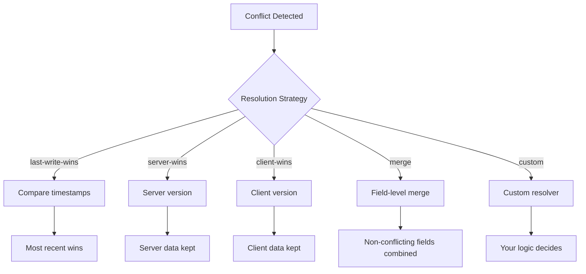

# Sync Architecture

Pocket's sync engine keeps data consistent across multiple devices and the server. This page explains how it works.

## Overview



Sync follows a **push/pull** model:
- **Push**: Local changes go to the server
- **Pull**: Remote changes come from the server

## Core Concepts

### Change Tracking

Every write operation creates a change event:

```typescript
{
  operation: 'insert' | 'update' | 'delete',
  documentId: 'abc123',
  document: { ... },           // Current state
  previousDocument: { ... },   // Previous state (for updates)
  timestamp: 1703001234567,
  sequence: 42,                // Local sequence number
  isFromSync: false,           // true if from remote
}
```

### Checkpoints

Checkpoints track sync progress:

```typescript
{
  serverSequence: 1000,        // Last known server position
  collections: {
    todos: 50,                 // Last synced sequence per collection
    users: 25,
  }
}
```

Clients resume sync from their last checkpoint, avoiding re-syncing everything.

### Soft Deletes

When sync is enabled, deletes are "soft":

```typescript
// With sync enabled
await todos.delete('123');
// Document is marked: { _id: '123', _deleted: true, ... }
// Still exists in storage for sync

// Without sync
await todos.delete('123');
// Document is removed from storage
```

Soft deletes ensure deletions propagate to other clients.

## Sync Engine

### Setup

```typescript
import { createSyncEngine } from 'pocket/sync';

const sync = createSyncEngine(db, {
  serverUrl: 'https://api.example.com/sync',
  authToken: 'user-token',
  collections: ['todos', 'notes'],  // Which collections to sync
  direction: 'both',                // 'push' | 'pull' | 'both'
  useWebSocket: true,               // Real-time updates
  pullInterval: 30000,              // Poll every 30s (fallback)
});
```

### Starting Sync

```typescript
// Start syncing
await sync.start();

// Force immediate sync
await sync.forceSync();

// Stop syncing
await sync.stop();

// Clean up
sync.destroy();
```

### Sync Status

```typescript
// Subscribe to status changes
sync.getStatus().subscribe((status) => {
  // 'idle' | 'syncing' | 'error' | 'offline'
  console.log('Sync status:', status);
});

// Subscribe to statistics
sync.getStats().subscribe((stats) => {
  console.log('Pushed:', stats.pushCount);
  console.log('Pulled:', stats.pullCount);
  console.log('Conflicts:', stats.conflictCount);
  console.log('Last sync:', new Date(stats.lastSyncAt));
});
```

## Transport Layer

### WebSocket (Default)

WebSocket provides real-time bi-directional sync:

```typescript
const sync = createSyncEngine(db, {
  serverUrl: 'wss://api.example.com/sync',
  useWebSocket: true,
});
```

Benefits:
- Real-time updates
- Efficient for frequent changes
- Automatic reconnection

### HTTP Polling

HTTP works when WebSocket isn't available:

```typescript
const sync = createSyncEngine(db, {
  serverUrl: 'https://api.example.com/sync',
  useWebSocket: false,
  pullInterval: 10000,  // Poll every 10 seconds
});
```

Benefits:
- Works behind restrictive firewalls
- Simpler server implementation
- Stateless

## Push Flow



### Optimistic Updates

Changes apply locally immediately:

```typescript
// This returns instantly
await todos.insert({ _id: '1', title: 'New todo', completed: false });
// UI updates immediately

// Sync happens in the background
// If push fails, change is queued for retry
```

### Retry Logic

Failed pushes retry automatically:

```typescript
const sync = createSyncEngine(db, {
  serverUrl: 'https://api.example.com/sync',
  autoRetry: true,
  retryDelay: 1000,      // Start with 1s delay
  maxRetryAttempts: 5,   // Give up after 5 attempts
});
```

## Pull Flow



### Applying Remote Changes

Remote changes are applied through the sync layer:

```typescript
// Internally, sync engine does:
await collection.applyRemoteChange({
  operation: 'update',
  documentId: '123',
  document: { ... },
  isFromSync: true,  // Marked as remote
});

// This:
// 1. Updates local storage
// 2. Emits change event (with isFromSync: true)
// 3. Triggers live query updates
// 4. Does NOT trigger another push (prevents loops)
```

## Conflict Resolution

Conflicts occur when the same document is modified on multiple clients before sync.



### Detection

```typescript
// Client A: update title
await todos.update('123', { title: 'A title' });

// Client B: update title (before A syncs)
await todos.update('123', { title: 'B title' });

// When both push, server detects conflict via revision mismatch
```

### Resolution Strategies

```typescript
const sync = createSyncEngine(db, {
  serverUrl: 'https://api.example.com/sync',
  conflictStrategy: 'last-write-wins', // Default
});
```

Available strategies:



| Strategy | Description |
|----------|-------------|
| `last-write-wins` | Most recent timestamp wins |
| `server-wins` | Server version always wins |
| `client-wins` | Client version always wins |
| `merge` | Merge non-conflicting fields |
| `custom` | Your custom resolver function |

### Custom Resolver

```typescript
const sync = createSyncEngine(db, {
  serverUrl: 'https://api.example.com/sync',
  conflictStrategy: 'custom',
  conflictResolver: (conflict) => {
    // conflict.localDocument - what we have
    // conflict.remoteDocument - what server has
    // conflict.documentId - the document ID

    // Return the resolved document
    return {
      ...conflict.remoteDocument,
      ...conflict.localDocument,
      _rev: conflict.remoteDocument._rev, // Use server revision
    };
  },
});
```

See [Conflict Resolution Guide](/docs/guides/conflict-resolution) for detailed examples.

## Server Implementation

Pocket provides a server package for Node.js:

```typescript
import { createSyncServer } from '@pocket/server';
import { WebSocketServer } from 'ws';

const wss = new WebSocketServer({ port: 8080 });
const syncServer = createSyncServer({
  // Your database connection
  storage: yourServerStorage,
});

wss.on('connection', (ws) => {
  syncServer.handleConnection(ws);
});
```

### Server Responsibilities

1. **Store changes** - Persist all changes with sequence numbers
2. **Track clients** - Know each client's checkpoint
3. **Resolve conflicts** - Apply conflict strategy
4. **Broadcast** - Notify other clients of changes

## Security Considerations

### Authentication

```typescript
const sync = createSyncEngine(db, {
  serverUrl: 'https://api.example.com/sync',
  authToken: await getAuthToken(),
});

// Token refresh
sync.setAuthToken(newToken);
```

### Authorization

The server should validate:
- User can access the collection
- User can modify the specific document
- Changes are within allowed scope

### Data Validation

Server should validate incoming data:

```typescript
// Server-side
syncServer.on('push', (changes, userId) => {
  for (const change of changes) {
    if (!canUserModify(userId, change.collection, change.documentId)) {
      throw new Error('Unauthorized');
    }
    validateDocument(change.document);
  }
});
```

## Next Steps

- [Sync Setup Guide](/docs/guides/sync-setup) - Step-by-step setup
- [Conflict Resolution](/docs/guides/conflict-resolution) - Handle conflicts
- [SyncEngine API](/docs/api/sync-engine) - Complete API reference
