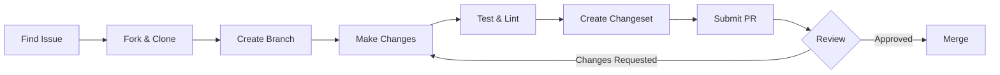
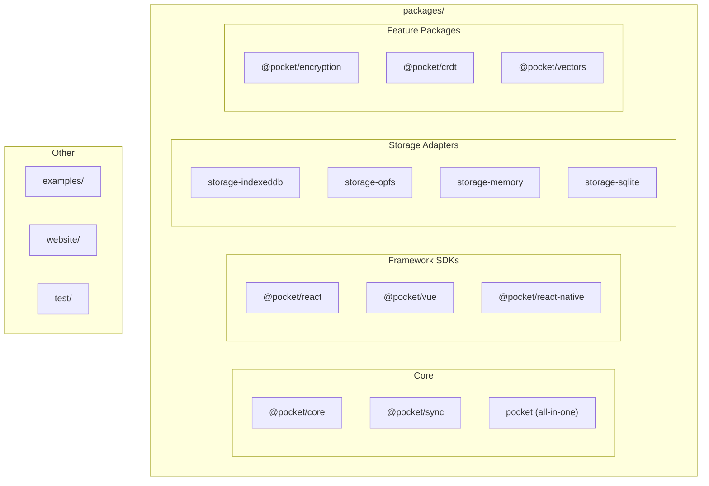
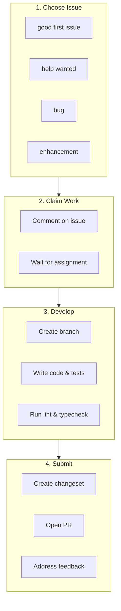
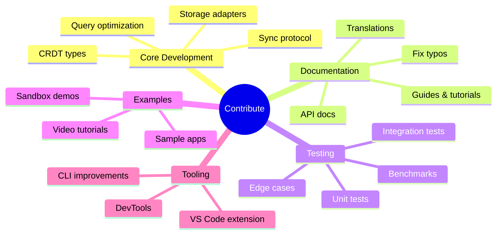

# Contributing to Pocket

Thank you for your interest in contributing to Pocket! This guide covers everything you need to know to make meaningful contributions to the project.

:::tip First Time?
Look for issues labeled [`good first issue`](https://github.com/pocket-db/pocket/labels/good%20first%20issue) - these are beginner-friendly and a great way to start.
:::

## Contribution Workflow



## Quick Start

```bash
# 1. Fork and clone
git clone https://github.com/YOUR_USERNAME/pocket.git
cd pocket

# 2. Install dependencies
pnpm install

# 3. Build all packages
pnpm build

# 4. Run tests
pnpm test
```

## Prerequisites

Before you begin, make sure you have:

- **Node.js** 18.0.0 or later
- **pnpm** 8.12.0 or later
- **Git** for version control
- A GitHub account

### Installing pnpm

```bash
# Using npm
npm install -g pnpm

# Using Corepack (recommended)
corepack enable
corepack prepare pnpm@8.12.0 --activate
```

## Project Structure



### Directory Layout

| Directory | Description |
|-----------|-------------|
| `packages/core` | Core database engine - the heart of Pocket |
| `packages/react` | React hooks and components |
| `packages/sync` | Client-side sync engine |
| `packages/server` | Server-side sync endpoint |
| `packages/storage-*` | Storage adapter implementations |
| `packages/pocket` | All-in-one umbrella package |
| `examples/` | Example applications |
| `website/` | Docusaurus documentation site |
| `test/` | Integration and E2E tests |

## Development Workflow



### 1. Choose What to Work On

**New contributors** should start with issues labeled:
- [`good first issue`](https://github.com/pocket-db/pocket/labels/good%20first%20issue) - Beginner-friendly
- [`help wanted`](https://github.com/pocket-db/pocket/labels/help%20wanted) - Community help needed

**Before starting work:**
1. Check if someone is already working on it
2. Comment on the issue to claim it
3. Wait for maintainer confirmation

### 2. Create a Branch

```bash
# Sync with upstream
git fetch origin
git checkout main
git pull origin main

# Create feature branch
git checkout -b feature/your-feature-name
# or for bug fixes
git checkout -b fix/your-fix-name
```

### 3. Make Changes

Follow these guidelines:

- **One concern per PR**: Keep changes focused
- **Write tests**: All new code should have tests
- **Update docs**: Add/update documentation as needed
- **Follow existing style**: Match the codebase patterns

### 4. Test Your Changes

```bash
# Run all tests
pnpm test

# Run tests for a specific package
pnpm --filter @pocket/core test

# Run tests in watch mode
pnpm test:watch

# Run tests with coverage
pnpm test:coverage

# Type checking
pnpm typecheck

# Lint code
pnpm lint

# Check formatting
pnpm format:check
```

### 5. Commit Your Changes

Write clear commit messages:

```bash
# Good commit messages
git commit -m "feat(core): add batch insert operation"
git commit -m "fix(sync): resolve reconnection race condition"
git commit -m "docs: update query builder examples"
git commit -m "test(react): add hook cleanup tests"

# Bad commit messages
git commit -m "fix"
git commit -m "WIP"
git commit -m "changes"
```

**Commit message format:**

```
type(scope): description

[optional body]

[optional footer]
```

Types: `feat`, `fix`, `docs`, `test`, `refactor`, `style`, `chore`

### 6. Create a Changeset

For changes to published packages:

```bash
pnpm changeset
```

This will prompt you to:
1. Select affected packages
2. Choose version bump type (patch/minor/major)
3. Write a changelog entry

### 7. Submit a Pull Request

1. Push your branch: `git push origin feature/your-feature-name`
2. Open a PR against the `main` branch
3. Fill out the PR template completely
4. Wait for CI checks to pass
5. Request a review

## Code Guidelines

### TypeScript

```typescript
// Use explicit types for function parameters and returns
function insertDocument<T extends Document>(
  collection: Collection<T>,
  document: Omit<T, '_id'>
): Promise<T> {
  // ...
}

// Avoid `any`, use `unknown` and type guards
function processValue(value: unknown): string {
  if (typeof value === 'string') {
    return value;
  }
  return String(value);
}

// Use JSDoc for public APIs
/**
 * Creates a new database instance.
 *
 * @param config - Database configuration options
 * @returns A promise that resolves to the database instance
 *
 * @example
 * ```typescript
 * const db = await Database.create({
 *   name: 'my-app',
 *   storage: createIndexedDBStorage(),
 * });
 * ```
 */
export async function create(config: DatabaseConfig): Promise<Database> {
  // ...
}
```

### Testing

```typescript
import { describe, it, expect, beforeEach, afterEach } from 'vitest';

describe('Collection', () => {
  let db: Database;
  let collection: Collection<TestDoc>;

  beforeEach(async () => {
    db = await Database.create({
      name: 'test-db',
      storage: createMemoryStorage(),
    });
    collection = db.collection('test');
  });

  afterEach(async () => {
    await db.destroy();
  });

  describe('insert', () => {
    it('should insert a document and return it with _id', async () => {
      const doc = await collection.insert({ name: 'test' });

      expect(doc._id).toBeDefined();
      expect(doc.name).toBe('test');
    });

    it('should throw on duplicate _id', async () => {
      await collection.insert({ _id: 'doc-1', name: 'test' });

      await expect(
        collection.insert({ _id: 'doc-1', name: 'test2' })
      ).rejects.toThrow('already exists');
    });
  });
});
```

### Error Handling

```typescript
// Define specific error types
export class DocumentNotFoundError extends Error {
  constructor(
    public readonly collectionName: string,
    public readonly documentId: string
  ) {
    super(`Document '${documentId}' not found in collection '${collectionName}'`);
    this.name = 'DocumentNotFoundError';
  }
}

// Use error types consistently
if (!document) {
  throw new DocumentNotFoundError(this.name, id);
}
```

## Common Commands

| Command | Description |
|---------|-------------|
| `pnpm build` | Build all packages |
| `pnpm dev` | Build in watch mode |
| `pnpm test` | Run all tests |
| `pnpm test:watch` | Run tests in watch mode |
| `pnpm test:coverage` | Run tests with coverage report |
| `pnpm typecheck` | TypeScript type checking |
| `pnpm lint` | Run ESLint |
| `pnpm lint:fix` | Fix ESLint issues |
| `pnpm format` | Format code with Prettier |
| `pnpm format:check` | Check code formatting |
| `pnpm changeset` | Create a changeset |
| `pnpm clean` | Clean build artifacts |
| `pnpm docs:dev` | Run documentation site locally |

## Working on Documentation

### Local Development

```bash
# Start the docs site
cd website
pnpm install
pnpm start

# Build and preview
pnpm build
pnpm serve
```

### Documentation Guidelines

- Use clear, concise language
- Include code examples for all features
- Test code examples to ensure they work
- Add links to related documentation
- Use admonitions for important notes:

```markdown
:::tip
Use this for helpful tips
:::

:::warning
Use this for warnings
:::

:::danger
Use this for critical warnings
:::
```

## Areas for Contribution



### Core Development

- New storage adapters
- Query optimizations
- New CRDT types
- Sync protocol improvements

### Documentation

- Improve existing guides
- Add new tutorials
- Fix typos and errors
- Translate documentation

### Testing

- Increase test coverage
- Add integration tests
- Add performance benchmarks
- Test edge cases

### Examples

- Create example applications
- Add CodeSandbox/StackBlitz demos
- Create video tutorials

### Tooling

- Improve developer experience
- Add debugging tools
- Create VS Code extension

## Issue Labels

| Label | Description |
|-------|-------------|
| `bug` | Something isn't working |
| `enhancement` | New feature or request |
| `documentation` | Documentation improvements |
| `good first issue` | Good for newcomers |
| `help wanted` | Extra attention needed |
| `area:core` | Related to @pocket/core |
| `area:react` | Related to @pocket/react |
| `area:sync` | Related to @pocket/sync |
| `area:storage` | Related to storage adapters |
| `priority:critical` | Must be fixed ASAP |
| `priority:high` | High priority |

## Getting Help

- **Questions**: Use [GitHub Discussions](https://github.com/pocket-db/pocket/discussions)
- **Bugs**: Open an [issue](https://github.com/pocket-db/pocket/issues/new)
- **Feature requests**: Start a [discussion](https://github.com/pocket-db/pocket/discussions/new?category=ideas)

## Code of Conduct

Please read and follow our [Code of Conduct](https://github.com/pocket-db/pocket/blob/main/CODE_OF_CONDUCT.md). We are committed to providing a welcoming and inclusive environment for all contributors.

## License

By contributing to Pocket, you agree that your contributions will be licensed under the [MIT License](https://github.com/pocket-db/pocket/blob/main/LICENSE).
