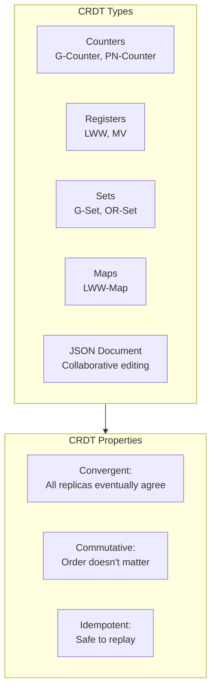
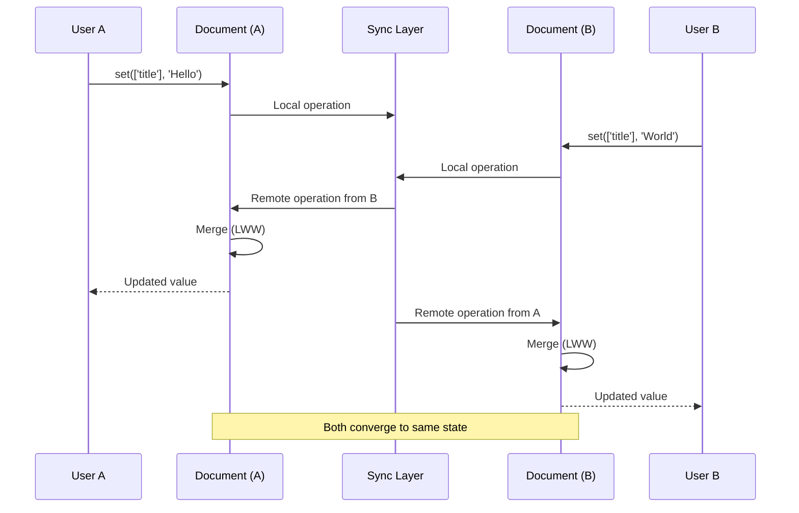

# CRDTs

Pocket's `@pocket/crdt` package provides Conflict-free Replicated Data Types (CRDTs) for building collaborative applications. CRDTs automatically resolve conflicts without coordination, enabling real-time collaboration and offline-first experiences.

## Overview



The CRDT package provides:
- **Counters**: G-Counter (grow-only), PN-Counter (increment/decrement)
- **Registers**: LWW-Register (last-writer-wins), MV-Register (multi-value)
- **Sets**: G-Set (grow-only), OR-Set (observed-remove)
- **Maps**: LWW-Map (last-writer-wins map)
- **JSON Documents**: Collaborative JSON editing with field-level conflict resolution
- **Awareness**: Real-time presence, cursors, and selections

## Installation

```bash
npm install @pocket/core @pocket/crdt
```

## Quick Start

```typescript
import { createJSONCRDTDocument, createAwarenessManager } from '@pocket/crdt';

// Create a collaborative document
const doc = createJSONCRDTDocument('doc-1', 'user-123', {
  title: 'My Document',
  content: '',
});

// Make local changes
doc.set(['content'], 'Hello, World!');

// Get current value
console.log(doc.getValue());
// { title: 'My Document', content: 'Hello, World!' }

// Apply remote changes
doc.applyRemote(remoteOperation);
```

## CRDT Primitives

### G-Counter (Grow-only Counter)

A counter that can only be incremented. Perfect for tracking views, likes, or any monotonically increasing value.

```typescript
import { createGCounter } from '@pocket/crdt';

// Create counter on node 'user-1'
const counter = createGCounter('user-1');

// Increment
counter.increment();     // +1
counter.increment(5);    // +5

// Get current value
console.log(counter.value()); // 6

// Merge with another node's counter
const otherState = { 'user-2': 10 }; // From another replica
counter.merge(otherState);

console.log(counter.value()); // 16 (6 + 10)

// Get state for syncing
const state = counter.getState();
// { 'user-1': 6, 'user-2': 10 }
```

### PN-Counter (Positive-Negative Counter)

A counter that supports both increment and decrement operations.

```typescript
import { createPNCounter } from '@pocket/crdt';

const counter = createPNCounter('user-1');

// Increment and decrement
counter.increment(10);
counter.decrement(3);

console.log(counter.value()); // 7

// Merge with remote state
const remoteState = {
  positive: { 'user-2': 5 },
  negative: { 'user-2': 2 },
};
counter.merge(remoteState);

console.log(counter.value()); // 10 (7 + 5 - 2)

// Get state for syncing
const state = counter.getState();
// { positive: { 'user-1': 10, 'user-2': 5 }, negative: { 'user-1': 3, 'user-2': 2 } }
```

### LWW-Register (Last-Writer-Wins Register)

A register where concurrent writes are resolved by timestamp. The most recent write wins.

```typescript
import { createLWWRegister } from '@pocket/crdt';

const register = createLWWRegister<string>('user-1', 'initial value');

// Set new value
const { value, timestamp } = register.set('new value');

// Get current value
console.log(register.get()); // 'new value'

// Apply remote update (only applied if timestamp is newer)
const applied = register.applyRemote('remote value', {
  counter: 100,
  nodeId: 'user-2',
});

if (applied) {
  console.log('Remote update applied:', register.get());
}

// Merge with another register
const result = register.merge({
  value: 'merged value',
  timestamp: { counter: 200, nodeId: 'user-3' },
});

if (result.hadConflict) {
  console.log('Concurrent writes detected');
}
```

### MV-Register (Multi-Value Register)

A register that preserves all concurrent values, allowing application-level conflict resolution.

```typescript
import { createMVRegister } from '@pocket/crdt';

const register = createMVRegister<string>('user-1', 'initial');

// Set value
register.set('value from user 1');

// Apply concurrent remote update
register.applyRemote('value from user 2', { 'user-2': 1 });

// Check for conflicts
if (register.hasConflict()) {
  console.log('Conflicting values:', register.getConflicts());
  // ['value from user 1', 'value from user 2']

  // Resolve by choosing one value
  register.resolve('resolved value');
}

// Get single value (undefined if conflict)
const value = register.get();

// Get all values (always returns array)
const allValues = register.getAll();
```

### G-Set (Grow-only Set)

A set that only supports adding elements. Elements cannot be removed.

```typescript
import { createGSet } from '@pocket/crdt';

const set = createGSet<string>();

// Add elements
set.add('apple');
set.add('banana');
set.add('cherry');

// Check membership
console.log(set.has('apple')); // true
console.log(set.size);         // 3

// Get all elements
const elements = set.values(); // ['apple', 'banana', 'cherry']

// Merge with another set
set.merge(['date', 'elderberry']);
console.log(set.values()); // ['apple', 'banana', 'cherry', 'date', 'elderberry']

// Iterate
for (const fruit of set) {
  console.log(fruit);
}
```

### OR-Set (Observed-Remove Set)

A set that supports both add and remove operations with proper conflict resolution.

```typescript
import { createORSet } from '@pocket/crdt';

const set = createORSet<string>('user-1');

// Add elements
const { element, tag } = set.add('apple');
set.add('banana');

// Remove elements
const removedTags = set.remove('apple');

// Check membership
console.log(set.has('apple'));  // false
console.log(set.has('banana')); // true

// Apply remote add
set.applyRemoteAdd('cherry', 'user-2:1');

// Apply remote remove
set.applyRemoteRemove('banana', ['user-1:2']);

// Merge with another OR-Set state
const remoteState = {
  elements: {
    '"date"': { value: 'date', tags: ['user-3:1'] },
  },
  tombstones: [],
};
set.merge(remoteState);

console.log(set.values()); // ['cherry', 'date']
```

### LWW-Map (Last-Writer-Wins Map)

A map where each key has LWW-Register semantics.

```typescript
import { createLWWMap } from '@pocket/crdt';

const map = createLWWMap<string, number>('user-1');

// Set values
map.set('counter', 10);
map.set('score', 100);

// Get values
console.log(map.get('counter')); // 10

// Delete keys
map.delete('score');

// Check existence
console.log(map.has('counter')); // true
console.log(map.has('score'));   // false

// Iterate
console.log(map.keys());   // ['counter']
console.log(map.values()); // [10]
console.log(map.size);     // 1

// Apply remote operations
map.applyRemoteSet('newKey', 42, { counter: 5, nodeId: 'user-2' });
map.applyRemoteDelete('counter', { counter: 10, nodeId: 'user-2' });

// Convert to plain object
const obj = map.toObject();
// { newKey: 42 }

// Merge with another map
map.merge(remoteMapState);
```

## JSON CRDT Document

For collaborative JSON editing with field-level conflict resolution.

```typescript
import { createJSONCRDTDocument } from '@pocket/crdt';

// Create a document
const doc = createJSONCRDTDocument('doc-1', 'user-123', {
  title: 'Untitled',
  content: '',
  metadata: {
    author: 'User 123',
    created: Date.now(),
  },
});

// Get current value
const value = doc.getValue();

// Set values at paths
doc.set(['title'], 'My Document');
doc.set(['content'], 'Hello, World!');
doc.set(['metadata', 'modified'], Date.now());

// Get value at path
const title = doc.getValueAt(['title']);

// Delete value at path
doc.delete(['metadata', 'temporary']);
```

### Applying Remote Operations

```typescript
// Subscribe to local operations
doc.events().subscribe((event) => {
  if (event.type === 'operation:local') {
    // Broadcast to other peers
    broadcastToPeers(event.operation);
  }
});

// Apply operations from other peers
function handleRemoteOperation(op: JSONCRDTOperation) {
  const result = doc.applyRemote(op);

  if (result.hadConflict) {
    console.log('Conflict detected:', result.conflictingValues);
  }
}
```

### Syncing Documents



```typescript
// Get pending operations to sync
const pendingOps = doc.getPendingOps();

// After server acknowledges
doc.acknowledgeOps(acknowledgedOpIds);

// Get full state for sync
const state = doc.getState();

// Merge with another document's state
const result = doc.merge(remoteState);

// Load state (e.g., from storage)
doc.loadState(savedState);

// Get vector clock for sync decisions
const vclock = doc.getVectorClock();
```

### Handling Events

```typescript
doc.events().subscribe((event) => {
  switch (event.type) {
    case 'operation:local':
      console.log('Local operation:', event.operation);
      break;
    case 'operation:remote':
      console.log('Remote operation from:', event.nodeId);
      break;
    case 'conflict:detected':
      console.log('Conflict on operation:', event.operation);
      break;
  }
});
```

## Clock Utilities

### Lamport Clock

For ordering distributed events:

```typescript
import { LamportClock, compareLamportTimestamps } from '@pocket/crdt';

const clock = new LamportClock('node-1');

// Get current timestamp
const now = clock.now();

// Tick (increment) for local events
const timestamp = clock.tick();

// Update based on received timestamp
const receivedTs = { counter: 10, nodeId: 'node-2' };
clock.receive(receivedTs);

// Compare timestamps
const comparison = compareLamportTimestamps(ts1, ts2);
// negative: ts1 < ts2
// positive: ts1 > ts2
// zero: equal
```

### Vector Clock

For tracking causality between distributed nodes:

```typescript
import {
  VectorClockImpl,
  compareVectorClocks,
  mergeVectorClocks,
} from '@pocket/crdt';

const vclock = new VectorClockImpl('node-1');

// Increment local counter
vclock.increment();

// Merge with another vector clock
vclock.merge({ 'node-2': 5, 'node-3': 3 });

// Get current state
const clock = vclock.getClock();

// Compare two vector clocks
const result = compareVectorClocks(clock1, clock2);
// 'before' - clock1 happened-before clock2
// 'after' - clock1 happened-after clock2
// 'concurrent' - neither happened-before the other
// 'equal' - identical

// Merge two clocks
const merged = mergeVectorClocks(clock1, clock2);
```

## Awareness (Presence)

Track real-time presence, cursors, and selections for collaborative editing.

```typescript
import { createAwarenessManager } from '@pocket/crdt';

const awareness = createAwarenessManager('user-123');

// Set user info
awareness.setUser({
  name: 'John Doe',
  color: '#ff6b6b',
  avatar: 'https://example.com/avatar.jpg',
});

// Set cursor position (for text editing)
awareness.setCursor(100, 105); // anchor, head

// Set selection (for structured data)
awareness.setSelection(['items', '0', 'title'], 'field');

// Get local state
const localState = awareness.getLocalState();
```

### Broadcasting Presence

```typescript
// Subscribe to local updates for broadcasting
awareness.updatesObservable().subscribe((update) => {
  broadcastToOtherPeers(update);
});

// Apply remote awareness updates
function handleRemoteAwareness(update: AwarenessUpdate) {
  awareness.applyRemoteUpdate(update);
}

// Clear local state (when disconnecting)
awareness.clearLocalState();
```

### Getting Peer Information

```typescript
// Get all peers
const peers = awareness.getPeers();

// Get online peers only
const onlinePeers = awareness.getOnlinePeers();

// Get specific peer
const peer = awareness.getPeer('user-456');

// Subscribe to peer changes
awareness.peersObservable().subscribe((peers) => {
  console.log('Peers updated:', peers.size);
});
```

### Getting Cursors and Selections

```typescript
// Get all peer cursors
const cursors = awareness.getCursors();
for (const { nodeId, cursor, user } of cursors) {
  console.log(`${user?.name}'s cursor at ${cursor.anchor}-${cursor.head}`);
}

// Get all peer selections
const selections = awareness.getSelections();
for (const { nodeId, selection, user } of selections) {
  console.log(`${user?.name} selected ${selection.path.join('.')}`);
}
```

## React Integration

### useCollaborativeDocument Hook

```tsx
import { useState, useEffect, useMemo } from 'react';
import { createJSONCRDTDocument, createAwarenessManager } from '@pocket/crdt';
import type { JSONCRDTDocument, AwarenessManager, CollaborationEvent } from '@pocket/crdt';

function useCollaborativeDocument<T extends Record<string, unknown>>(
  documentId: string,
  userId: string,
  initialValue: T
) {
  const [value, setValue] = useState<T>(initialValue);
  const [peers, setPeers] = useState<Map<string, PeerState>>(new Map());

  const { doc, awareness } = useMemo(() => {
    const doc = createJSONCRDTDocument(documentId, userId, initialValue);
    const awareness = createAwarenessManager(userId);
    return { doc, awareness };
  }, [documentId, userId]);

  // Subscribe to document changes
  useEffect(() => {
    const sub = doc.events().subscribe((event) => {
      if (event.type === 'operation:local' || event.type === 'operation:remote') {
        setValue(doc.getValue() as T);
      }
    });
    return () => sub.unsubscribe();
  }, [doc]);

  // Subscribe to peer changes
  useEffect(() => {
    const sub = awareness.peersObservable().subscribe(setPeers);
    return () => sub.unsubscribe();
  }, [awareness]);

  const update = (path: string[], newValue: unknown) => {
    doc.set(path, newValue);
  };

  const remove = (path: string[]) => {
    doc.delete(path);
  };

  return {
    value,
    update,
    remove,
    peers,
    doc,
    awareness,
  };
}
```

### Collaborative Editor Component

```tsx
function CollaborativeEditor({ documentId, userId }: Props) {
  const { value, update, peers, awareness } = useCollaborativeDocument(
    documentId,
    userId,
    { title: '', content: '' }
  );

  // Set user info on mount
  useEffect(() => {
    awareness.setUser({
      name: 'User ' + userId.slice(0, 4),
      color: getRandomColor(),
    });

    return () => awareness.dispose();
  }, []);

  // Render peer cursors
  const cursors = awareness.getCursors();

  return (
    <div className="editor">
      <input
        value={value.title}
        onChange={(e) => update(['title'], e.target.value)}
        placeholder="Title"
      />
      <textarea
        value={value.content}
        onChange={(e) => update(['content'], e.target.value)}
        onSelect={(e) => {
          const target = e.target as HTMLTextAreaElement;
          awareness.setCursor(target.selectionStart, target.selectionEnd);
        }}
        placeholder="Content"
      />

      {/* Show who else is editing */}
      <div className="collaborators">
        {Array.from(peers.values())
          .filter((p) => p.online)
          .map((peer) => (
            <span
              key={peer.nodeId}
              style={{ color: peer.awareness?.user?.color }}
            >
              {peer.awareness?.user?.name}
            </span>
          ))}
      </div>
    </div>
  );
}
```

## Network Integration

### WebSocket Sync

```typescript
import { createJSONCRDTDocument, createAwarenessManager } from '@pocket/crdt';

class CollaborativeSession {
  private doc: JSONCRDTDocument;
  private awareness: AwarenessManager;
  private ws: WebSocket;

  constructor(documentId: string, userId: string, wsUrl: string) {
    this.doc = createJSONCRDTDocument(documentId, userId, {});
    this.awareness = createAwarenessManager(userId);
    this.ws = new WebSocket(wsUrl);

    this.setupSync();
  }

  private setupSync() {
    // Send local operations
    this.doc.events().subscribe((event) => {
      if (event.type === 'operation:local') {
        this.ws.send(JSON.stringify({
          type: 'operation',
          operation: event.operation,
        }));
      }
    });

    // Send awareness updates
    this.awareness.updatesObservable().subscribe((update) => {
      this.ws.send(JSON.stringify({
        type: 'awareness',
        update,
      }));
    });

    // Receive messages
    this.ws.onmessage = (event) => {
      const message = JSON.parse(event.data);

      switch (message.type) {
        case 'operation':
          this.doc.applyRemote(message.operation);
          break;
        case 'awareness':
          this.awareness.applyRemoteUpdate(message.update);
          break;
        case 'sync':
          this.doc.loadState(message.state);
          break;
      }
    };

    // Request initial sync
    this.ws.onopen = () => {
      this.ws.send(JSON.stringify({
        type: 'sync-request',
        vclock: this.doc.getVectorClock(),
      }));
    };
  }

  getValue() {
    return this.doc.getValue();
  }

  set(path: string[], value: unknown) {
    return this.doc.set(path, value);
  }

  dispose() {
    this.awareness.dispose();
    this.doc.dispose();
    this.ws.close();
  }
}
```

## Persistence

### Saving and Loading State

```typescript
import { createJSONCRDTDocument } from '@pocket/crdt';

// Create document
const doc = createJSONCRDTDocument('doc-1', 'user-1', { title: 'Test' });

// Make some changes
doc.set(['title'], 'Updated Title');
doc.set(['content'], 'Hello World');

// Save state
const state = doc.getState();
localStorage.setItem('doc-1-state', JSON.stringify(state));

// Later: Load state
const savedState = JSON.parse(localStorage.getItem('doc-1-state')!);
const restoredDoc = createJSONCRDTDocument('doc-1', 'user-1');
restoredDoc.loadState(savedState);

console.log(restoredDoc.getValue());
// { title: 'Updated Title', content: 'Hello World' }
```

### With Pocket Database

```typescript
import { Database, createIndexedDBStorage } from 'pocket';
import { createJSONCRDTDocument } from '@pocket/crdt';

// Store CRDT state in Pocket
const db = await Database.create({
  name: 'collab-app',
  storage: createIndexedDBStorage(),
});

const crdtStates = db.collection('crdt-states');

// Save CRDT state
async function saveCRDTState(doc: JSONCRDTDocument) {
  const state = doc.getState();
  await crdtStates.upsert({
    _id: doc.getId(),
    state,
  });
}

// Load CRDT state
async function loadCRDTState(
  documentId: string,
  nodeId: string
): Promise<JSONCRDTDocument> {
  const doc = createJSONCRDTDocument(documentId, nodeId);

  const saved = await crdtStates.get(documentId);
  if (saved) {
    doc.loadState(saved.state);
  }

  return doc;
}
```

## Conflict Resolution Strategies

### Last-Writer-Wins (LWW)

The most recent write wins. Simple but may lose data:

```typescript
// Use LWW-Register for simple values
const register = createLWWRegister<string>('node-1');
register.set('value A');

// Remote update with higher timestamp wins
register.applyRemote('value B', { counter: 100, nodeId: 'node-2' });
```

### Multi-Value with App-Level Resolution

Preserve all concurrent values and let the application decide:

```typescript
const register = createMVRegister<string>('node-1');
register.set('draft');
register.applyRemote('published', { 'node-2': 1 });

if (register.hasConflict()) {
  const values = register.getConflicts();

  // Application-specific resolution
  const resolved = values.includes('published') ? 'published' : values[0];
  register.resolve(resolved);
}
```

### Field-Level Resolution

JSON CRDT Document uses field-level LWW:

```typescript
// Two users editing different fields - no conflict
// User 1: doc.set(['title'], 'New Title');
// User 2: doc.set(['content'], 'New Content');
// Result: { title: 'New Title', content: 'New Content' }

// Two users editing same field - LWW applies
// User 1 at t=1: doc.set(['title'], 'Title A');
// User 2 at t=2: doc.set(['title'], 'Title B');
// Result: { title: 'Title B' } (User 2's later timestamp wins)
```

## Best Practices

### 1. Choose the Right CRDT Type

```typescript
// For counts: Use counters
const viewCount = createGCounter('node-1');    // Can only increase
const balance = createPNCounter('node-1');     // Can increase/decrease

// For single values: Use registers
const status = createLWWRegister<string>('node-1');  // Last write wins
const title = createMVRegister<string>('node-1');    // Keep all concurrent

// For collections: Use sets
const tags = createGSet<string>();             // Add-only
const items = createORSet<string>('node-1');   // Add and remove

// For key-value: Use maps or documents
const prefs = createLWWMap<string, unknown>('node-1');
const doc = createJSONCRDTDocument('doc-1', 'node-1', {});
```

### 2. Generate Unique Node IDs

```typescript
// Good: Unique per device/session
const nodeId = `${userId}-${deviceId}-${sessionId}`;

// Or use UUID
import { randomUUID } from '@pocket/encryption';
const nodeId = randomUUID();
```

### 3. Handle Offline/Online Transitions

```typescript
function handleOnline() {
  // Sync pending operations
  const pending = doc.getPendingOps();
  for (const op of pending) {
    sendToServer(op);
  }

  // Request remote changes
  requestSync(doc.getVectorClock());
}

function handleOffline() {
  // Operations continue to work offline
  doc.set(['offline_edit'], true);
  // Will sync when back online
}
```

### 4. Persist State Regularly

```typescript
// Save after each operation
doc.events().subscribe(async (event) => {
  if (event.type === 'operation:local') {
    await saveCRDTState(doc);
  }
});

// Or debounce for better performance
const debouncedSave = debounce(() => saveCRDTState(doc), 1000);
doc.events().subscribe(() => debouncedSave());
```

### 5. Clean Up Resources

```typescript
function cleanup() {
  // Dispose awareness (stops cleanup interval)
  awareness.dispose();

  // Dispose document (completes observables)
  doc.dispose();
}
```

## Complete Example

```typescript
import { Database, createIndexedDBStorage } from 'pocket';
import {
  createJSONCRDTDocument,
  createAwarenessManager,
  type JSONCRDTDocument,
  type AwarenessManager,
} from '@pocket/crdt';

interface Note {
  title: string;
  content: string;
  tags: string[];
}

class CollaborativeNoteEditor {
  private doc: JSONCRDTDocument;
  private awareness: AwarenessManager;
  private db: Database;

  constructor(
    private documentId: string,
    private userId: string,
    db: Database
  ) {
    this.db = db;
    this.doc = createJSONCRDTDocument(documentId, userId, {
      title: 'Untitled',
      content: '',
      tags: [],
    });
    this.awareness = createAwarenessManager(userId);

    this.setupEventHandlers();
  }

  private setupEventHandlers() {
    // Handle local operations
    this.doc.events().subscribe(async (event) => {
      if (event.type === 'operation:local') {
        // Persist locally
        await this.saveState();
        // Broadcast to peers
        this.broadcastOperation(event.operation);
      }
    });

    // Broadcast awareness changes
    this.awareness.updatesObservable().subscribe((update) => {
      this.broadcastAwareness(update);
    });
  }

  async initialize() {
    // Load saved state
    const states = this.db.collection('crdt-states');
    const saved = await states.get(this.documentId);
    if (saved) {
      this.doc.loadState(saved.state);
    }
  }

  getValue(): Note {
    return this.doc.getValue() as Note;
  }

  setTitle(title: string) {
    this.doc.set(['title'], title);
  }

  setContent(content: string) {
    this.doc.set(['content'], content);
  }

  addTag(tag: string) {
    const tags = this.getValue().tags;
    this.doc.set(['tags'], [...tags, tag]);
  }

  setCursor(start: number, end: number) {
    this.awareness.setCursor(start, end);
  }

  setUser(name: string, color: string) {
    this.awareness.setUser({ name, color });
  }

  getPeers() {
    return this.awareness.getOnlinePeers();
  }

  getCursors() {
    return this.awareness.getCursors();
  }

  applyRemoteOperation(op: any) {
    this.doc.applyRemote(op);
  }

  applyRemoteAwareness(update: any) {
    this.awareness.applyRemoteUpdate(update);
  }

  private async saveState() {
    const states = this.db.collection('crdt-states');
    await states.upsert({
      _id: this.documentId,
      state: this.doc.getState(),
    });
  }

  private broadcastOperation(op: any) {
    // Implementation depends on your network layer
    console.log('Broadcast operation:', op);
  }

  private broadcastAwareness(update: any) {
    // Implementation depends on your network layer
    console.log('Broadcast awareness:', update);
  }

  dispose() {
    this.awareness.dispose();
    this.doc.dispose();
  }
}

// Usage
const db = await Database.create({
  name: 'notes-app',
  storage: createIndexedDBStorage(),
});

const editor = new CollaborativeNoteEditor('note-1', 'user-123', db);
await editor.initialize();

editor.setUser('John', '#ff6b6b');
editor.setTitle('Meeting Notes');
editor.setContent('Discussion points...');
editor.addTag('work');

console.log(editor.getValue());
// { title: 'Meeting Notes', content: 'Discussion points...', tags: ['work'] }
```

## See Also

- [Sync Setup](/docs/guides/sync-setup) - Server synchronization
- [Conflict Resolution](/docs/guides/conflict-resolution) - Advanced conflict handling
- [React Integration](/docs/guides/react-integration) - React hooks and patterns
