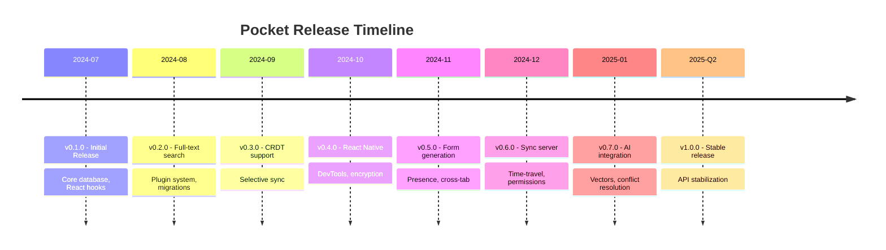
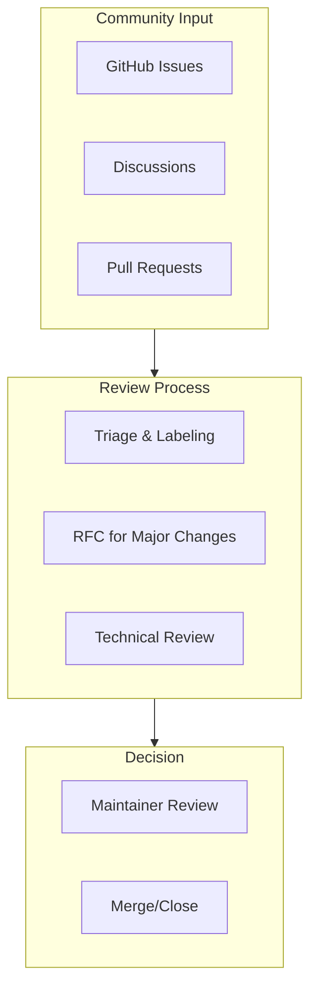

# Roadmap & Governance

This page outlines Pocket's development direction, how decisions are made, and what's coming next.

## Current Status

Pocket is currently in **beta** (v0.x). The API is stabilizing but may have breaking changes before v1.0.

## Roadmap

### v0.8.0 (In Progress)

| Feature | Status | Description |
|---------|--------|-------------|
| GraphQL adapter | 🔄 In Progress | GraphQL API for Pocket databases |
| SSR improvements | 🔄 In Progress | Better server-side rendering support |
| Multi-tenant support | 📋 Planned | Isolated databases per tenant |
| Replication protocol v2 | 📋 Planned | Improved sync efficiency |

### v1.0.0 (Stable Release)

| Goal | Description |
|------|-------------|
| API stability | No breaking changes after v1.0 |
| Production ready | Battle-tested with real-world apps |
| Complete documentation | All features fully documented |
| Performance benchmarks | Published benchmarks vs alternatives |
| Security audit | Third-party security review |

### Future Considerations

These features are being considered for future releases:

| Feature | Interest | Notes |
|---------|----------|-------|
| PouchDB compatibility layer | High | Migration path from PouchDB |
| SQLite WASM in browser | High | Alternative to IndexedDB |
| WebRTC peer-to-peer sync | Medium | Serverless sync option |
| Deno and Bun support | Medium | Runtime compatibility |
| React Server Components | Medium | RSC integration |
| Offline-first PWA template | Medium | Starter template |

:::tip Vote on Features
Have a feature request? [Start a discussion](https://github.com/pocket-db/pocket/discussions/categories/ideas) and the community can vote on priorities.
:::

## Governance

### Decision Making

Pocket follows a **benevolent dictator** governance model during the beta phase, with plans to move toward a more distributed model after v1.0.

### How Decisions Are Made

| Type | Process |
|------|---------|
| **Bug fixes** | Review, approve, merge |
| **Small features** | Discussion in issue, implementation, review |
| **Large features** | RFC proposal, community feedback, approval |
| **Breaking changes** | RFC required, migration path documented |
| **Architecture changes** | RFC + ADR (Architecture Decision Record) |

### RFC Process

For significant changes, we use an RFC (Request for Comments) process:

1. **Proposal**: Author creates an RFC document describing the change
2. **Discussion**: Community provides feedback for 2 weeks minimum
3. **Revision**: Author incorporates feedback
4. **Decision**: Maintainers approve, request changes, or close
5. **Implementation**: Approved RFCs are implemented

RFCs are stored in [docs/rfcs/](https://github.com/pocket-db/pocket/tree/main/docs/rfcs).

## Versioning

Pocket follows [Semantic Versioning](https://semver.org/):

| Version | Meaning |
|---------|---------|
| **0.x.y** | Beta - API may change |
| **1.x.y** | Stable - API stable, no breaking changes in minor/patch |
| **x.0.0** | Major - May contain breaking changes |
| **x.y.0** | Minor - New features, backward compatible |
| **x.y.z** | Patch - Bug fixes only |

### Deprecation Policy

- Deprecated features are marked with `@deprecated` JSDoc
- Deprecated features continue to work for at least 2 minor versions
- Console warnings are shown when using deprecated features
- Migration guides are provided in the changelog

## Release Schedule

| Type | Frequency | Description |
|------|-----------|-------------|
| Patch | As needed | Bug fixes and security updates |
| Minor | Monthly | New features, improvements |
| Major | As needed | Breaking changes (rare after v1.0) |

Releases are published to npm and announced on:
- [GitHub Releases](https://github.com/pocket-db/pocket/releases)
- [Discord #announcements](https://discord.gg/pocket-db)
- [Twitter @pocket_db](https://twitter.com/pocket_db)

## Support Policy

| Version | Support Level |
|---------|---------------|
| Latest | Full support - bugs, security, features |
| Previous minor | Security fixes only |
| Older | No support - please upgrade |

## Security

### Reporting Vulnerabilities

**Do not** report security vulnerabilities in public GitHub issues.

Instead, email **security@pocket-db.dev** with:
- Description of the vulnerability
- Steps to reproduce
- Potential impact
- Suggested fix (if any)

We aim to respond within 48 hours and will coordinate disclosure.

### Security Releases

Critical security fixes are:
- Released as patches immediately
- Backported to the previous minor version
- Announced via GitHub Security Advisories

## Getting Involved

### Become a Contributor

1. Start with [`good first issue`](https://github.com/pocket-db/pocket/labels/good%20first%20issue) labels
2. Join [Discord](https://discord.gg/pocket-db) to connect with maintainers
3. Read the [Contributing Guide](/docs/contributing)

### Become a Maintainer

Active contributors may be invited to become maintainers. Maintainers:
- Have merge rights to the repository
- Help with issue triage and code review
- Participate in RFC decisions
- Are listed in [MAINTAINERS.md](https://github.com/pocket-db/pocket/blob/main/MAINTAINERS.md)

## Resources

- [GitHub Repository](https://github.com/pocket-db/pocket)
- [GitHub Discussions](https://github.com/pocket-db/pocket/discussions)
- [Discord Community](https://discord.gg/pocket-db)
- [Twitter Updates](https://twitter.com/pocket_db)
- [Changelog](/docs/changelog)
- [Contributing Guide](/docs/contributing)
